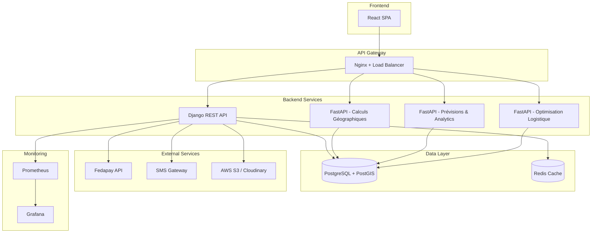

# Document de Conception - Plateforme Agricole Intelligente du Togo

## Vue d'Ensemble

La Plateforme Agricole Intelligente du Togo est un écosystème numérique complet visant à moderniser le secteur agricole togolais. Le système intègre plusieurs modules interconnectés:

1. **Gestion administrative**: Découpage territorial togolais (Région → Préfecture → Canton)
2. **Marketplace de documents**: Vente de documents techniques agricoles avec templates dynamiques
3. **Recrutement professionnel**: Mise en relation exploitants-agronomes avec validation administrative
4. **Emploi saisonnier**: Gestion de contrats d'ouvriers agricoles avec suivi des heures
5. **Prévente agricole**: Engagement de vente de production future avec acomptes sécurisés
6. **Intelligence de marché**: Prévisions de prix, analyse de demande, scoring de marchés
7. **Optimisation logistique**: Calcul d'itinéraires, estimation de coûts de transport
8. **Irrigation intelligente**: Cartographie des zones irrigables, estimation des besoins en eau
9. **Partenariat institutionnel**: Dashboards sécurisés pour le suivi sectoriel

### Objectifs Principaux

- Digitaliser les services agricoles avec géolocalisation précise au niveau cantonal
- Sécuriser les transactions via Fedapay (paiement mobile togolais)
- Fournir des analyses prédictives pour optimiser les décisions agricoles
- Créer un écosystème de confiance via vérification et notation
- Offrir des outils d'aide à la décision basés sur les données géographiques et de marché

### Contraintes Techniques

- Support mobile prioritaire (connexion 3G, optimisation données)
- Interface en français avec formats locaux (FCFA, dates JJ/MM/AAAA)
- Conformité réglementaire togolaise (protection des données, fiscalité)
- Performance: <500ms pour 95% des requêtes, support de 1000+ utilisateurs simultanés
- Sécurité: HTTPS/TLS 1.3, chiffrement des données sensibles, authentification 2FA pour institutions


## Architecture

### Architecture Globale

L'architecture suit un modèle hybride combinant monolithe Django pour les opérations CRUD standard et microservices FastAPI pour les calculs intensifs.



### Choix Architecturaux

**1. Django comme Backend Principal**
- Gestion des utilisateurs, authentification, autorisations
- CRUD pour entités métier (exploitations, agronomes, documents, etc.)
- Admin Django pour backoffice
- ORM pour requêtes standard
- Justification: Écosystème mature, admin intégré, sécurité éprouvée

**2. Microservices FastAPI pour Calculs Intensifs**
- Service géographique: calculs PostGIS (distances, zones irrigables, itinéraires)
- Service analytics: prévisions de prix, scoring de marchés, recommandations
- Service logistique: optimisation de tournées, estimation de coûts
- Justification: Performance Python pour calculs scientifiques, async pour I/O, typage strict

**3. PostgreSQL + PostGIS**
- Données relationnelles standard
- Extension PostGIS pour données géographiques (coordonnées GPS, polygones de zones)
- Support des requêtes spatiales (distance, intersection, containment)
- Justification: Robustesse, support géospatial natif, transactions ACID

**4. Redis pour Cache**
- Cache des données fréquemment consultées (découpage administratif, prix moyens)
- Sessions utilisateurs
- Rate limiting pour API
- Justification: Performance, TTL automatique, structures de données riches

**5. Architecture de Stockage**
- Documents techniques: S3/Cloudinary avec URLs signées temporaires
- Documents de vérification: Chiffrement au repos, accès restreint
- Images de profil: CDN pour optimisation mobile
- Justification: Scalabilité, sécurité, optimisation bande passante


### Patterns de Conception

**1. Repository Pattern**
- Abstraction de l'accès aux données
- Facilite les tests unitaires avec mocks
- Séparation logique métier / persistance

**2. Service Layer**
- Logique métier encapsulée dans des services
- Réutilisabilité entre API et tâches asynchrones
- Transactions gérées au niveau service

**3. Event-Driven pour Notifications**
- Événements métier (paiement confirmé, mission acceptée)
- Handlers asynchrones pour notifications multi-canal
- Découplage entre logique métier et notifications

**4. Strategy Pattern pour Calculs**
- Différentes stratégies de calcul de score marché
- Algorithmes d'optimisation de tournée interchangeables
- Facilite l'ajout de nouvelles méthodes de calcul

### Sécurité

**Authentification et Autorisation**
- JWT tokens avec refresh tokens
- RBAC (Role-Based Access Control): Exploitant, Agronome, Ouvrier, Acheteur, Institution, Admin
- 2FA obligatoire pour comptes institutionnels
- Rate limiting par IP et par utilisateur

**Protection des Données**
- Chiffrement TLS 1.3 en transit
- Chiffrement AES-256 au repos pour données sensibles
- Hachage bcrypt pour mots de passe (salt unique)
- Anonymisation des données dans exports institutionnels

**Validation et Sanitization**
- Validation stricte des entrées (Django Forms, Pydantic)
- Protection CSRF pour formulaires
- Sanitization des uploads (scan antivirus, validation MIME type)
- Échappement des sorties pour prévenir XSS


## Composants et Interfaces

### Module 1: Découpage Administratif

**Composants**
- `AdministrativeDivisionService`: Gestion de la hiérarchie Région → Préfecture → Canton
- `LocationCache`: Cache Redis pour requêtes fréquentes
- `LocationValidator`: Validation de cohérence hiérarchique

**Interfaces API**
```
GET /api/v1/regions
GET /api/v1/regions/{region_id}/prefectures
GET /api/v1/prefectures/{prefecture_id}/cantons
GET /api/v1/cantons/search?q={query}
```

**Structures de Données**
- Région: {id, nom, code}
- Préfecture: {id, nom, code, region_id}
- Canton: {id, nom, code, prefecture_id, coordonnees_centre}

### Module 2: Authentification et Profils

**Composants**
- `AuthService`: Authentification JWT, gestion sessions
- `UserProfileService`: CRUD profils utilisateurs
- `SMSVerificationService`: Envoi et validation codes SMS
- `TwoFactorAuthService`: 2FA pour comptes institutionnels

**Interfaces API**
```
POST /api/v1/auth/register
POST /api/v1/auth/login
POST /api/v1/auth/verify-sms
POST /api/v1/auth/refresh-token
GET /api/v1/users/me
PATCH /api/v1/users/me
```

**Types de Profils**
- Exploitant: {superficie_totale, cultures, canton_principal, statut_verification}
- Agronome: {specialisations[], canton_rattachement, statut_validation, badge}
- Ouvrier: {competences[], cantons_disponibles[], note_moyenne}
- Acheteur: {type_acheteur, volume_achats_annuel}
- Institution: {nom_organisme, niveau_acces, 2fa_enabled}

### Module 3: Marketplace de Documents

**Composants**
- `DocumentCatalogService`: Gestion catalogue, filtrage
- `TemplateEngine`: Substitution de variables dans templates
- `DocumentGenerationService`: Génération documents personnalisés
- `PurchaseService`: Gestion achats et téléchargements
- `SecureDownloadService`: Génération URLs signées temporaires

**Interfaces API**
```
GET /api/v1/documents?region={}&culture={}&type={}
GET /api/v1/documents/{id}
POST /api/v1/documents/{id}/purchase
GET /api/v1/documents/{id}/download?token={}
GET /api/v1/purchases/history
```

**Template Engine**
- Variables supportées: {{canton}}, {{prefecture}}, {{region}}, {{culture}}, {{date}}, {{prix}}
- Formats: Excel (.xlsx), Word (.docx)
- Validation: Vérification présence de toutes les variables requises

### Module 4: Paiement Fedapay

**Composants**
- `FedapayService`: Intégration API Fedapay
- `TransactionService`: Gestion transactions, webhooks
- `EscrowService`: Rétention paiements pour missions/préventes
- `CommissionCalculator`: Calcul commissions plateforme

**Interfaces API**
```
POST /api/v1/payments/initiate
POST /api/v1/payments/webhooks/fedapay
GET /api/v1/transactions/{id}
GET /api/v1/transactions/history
```

**Flux de Paiement**
1. Utilisateur initie achat → Création transaction (statut: PENDING)
2. Redirection vers Fedapay → Paiement utilisateur
3. Webhook Fedapay → Mise à jour statut (SUCCESS/FAILED)
4. Si SUCCESS → Déblocage ressource (document, mission, etc.)
5. Calcul et enregistrement commission

**Taux de Commission**
- Vente documents: 0% (prix fixe)
- Recrutement agronomes: 10%
- Préventes agricoles: 5%
- Transport: 8%


### Module 5: Recrutement Agronomes

**Composants**
- `AgronomistRegistrationService`: Inscription et validation
- `AgronomistDirectoryService`: Annuaire filtrable
- `MissionService`: Gestion missions et contrats
- `ValidationWorkflowService`: Workflow de validation administrative

**Interfaces API**
```
POST /api/v1/agronomists/register
POST /api/v1/agronomists/{id}/validate (admin)
GET /api/v1/agronomists?canton={}&specialisation={}
POST /api/v1/missions/create
POST /api/v1/missions/{id}/accept
POST /api/v1/missions/{id}/complete
```

**Workflow de Validation**
1. Agronome soumet inscription + documents
2. Statut: EN_ATTENTE_VALIDATION
3. Admin vérifie documents
4. Si OK: Statut VALIDE + Badge Agronome_Validé
5. Si KO: Statut REJETE + Notification avec motif

### Module 6: Vérification Exploitations

**Composants**
- `FarmVerificationService`: Gestion demandes de vérification
- `DocumentVerificationService`: Validation documents justificatifs
- `GPSValidationService`: Vérification cohérence GPS/superficie
- `PremiumAccessService`: Gestion accès fonctionnalités premium

**Interfaces API**
```
POST /api/v1/farms/verification-request
GET /api/v1/farms/{id}/verification-status
POST /api/v1/farms/{id}/verify (admin)
GET /api/v1/farms/me/premium-features
```

**Critères de Vérification**
- Superficie ≥ 10 hectares
- Documents valides: titre foncier OU certificat d'exploitation
- Coordonnées GPS cohérentes avec superficie déclarée
- Photos aériennes (optionnel mais recommandé)

### Module 7: Recrutement Ouvriers

**Composants**
- `SeasonalJobService`: Gestion offres d'emploi saisonnier
- `ContractService`: Génération et gestion contrats numériques
- `TimeTrackingService`: Suivi heures travaillées
- `DisputeResolutionService`: Médiation en cas de contestation

**Interfaces API**
```
POST /api/v1/jobs/create
GET /api/v1/jobs?canton={}&type={}
POST /api/v1/jobs/{id}/apply
POST /api/v1/contracts/{id}/log-hours
POST /api/v1/contracts/{id}/validate-hours
POST /api/v1/contracts/{id}/complete
```

**Gestion des Heures**
- Ouvrier enregistre heures quotidiennes
- Exploitant valide dans 24h
- Si contestation → Médiation automatique
- Calcul automatique: heures × taux_horaire
- Paiement à fin de contrat via Fedapay

### Module 8: Prévente Agricole

**Composants**
- `PresaleService`: Gestion préventes
- `ProductionEstimationService`: Validation quantités estimées
- `EscrowService`: Gestion acomptes (20%)
- `DeliveryConfirmationService`: Confirmation livraison

**Interfaces API**
```
POST /api/v1/presales/create
GET /api/v1/presales?culture={}&canton={}
POST /api/v1/presales/{id}/commit
POST /api/v1/presales/{id}/confirm-delivery
GET /api/v1/presales/my-commitments
```

**Flux Prévente**
1. Exploitant crée prévente (culture, quantité, date récolte, prix)
2. Acheteur s'engage → Acompte 20% via Fedapay
3. Acompte bloqué en escrow
4. À la récolte: Livraison
5. Acheteur confirme → Paiement solde (80%)
6. Transfert total à exploitant - commission 5%


### Module 9: Intelligence de Marché

**Composants**
- `PriceForecastingService`: Prévisions de prix (modèle time series)
- `DemandEstimationService`: Estimation demande régionale
- `MarketScoringService`: Calcul Score_Marché
- `MarketAnalyticsService`: Analyses et recommandations

**Interfaces API**
```
GET /api/v1/analytics/price-forecast?culture={}&region={}
GET /api/v1/analytics/demand-estimation?culture={}&region={}
GET /api/v1/analytics/market-scores?culture={}&farm_id={}
GET /api/v1/analytics/recommendations
```

**Algorithme Score_Marché**
```
Score = (Prix_Moyen × 0.4) + (Demande_Normalisée × 0.3) 
        - (Distance_Normalisée × 0.2) - (Coût_Transport_Normalisé × 0.1)
        
Normalisation sur échelle 0-100
```

**Prévision de Prix**
- Modèle: ARIMA ou Prophet (Facebook)
- Données: Historique 24 mois minimum
- Facteurs: Saison, production estimée, demande, importations
- Mise à jour: Hebdomadaire
- Horizon: 6 mois

### Module 10: Optimisation Logistique

**Composants**
- `DistanceCalculationService`: Calculs de distance (PostGIS)
- `TransportCostEstimator`: Estimation coûts de transport
- `RouteOptimizationService`: Optimisation de tournées
- `TransporterMatchingService`: Mise en relation transporteurs

**Interfaces API**
```
GET /api/v1/logistics/distance?from={}&to={}
GET /api/v1/logistics/transport-cost?distance={}&quantity={}&vehicle_type={}
POST /api/v1/logistics/optimize-route
GET /api/v1/logistics/transporters?capacity={}&zone={}
POST /api/v1/logistics/transport-request
```

**Calcul de Distance**
- Utilisation PostGIS: ST_Distance avec projection appropriée
- Type: Distance routière (pas à vol d'oiseau)
- Données: Réseau routier togolais
- Cache: Redis pour paires fréquentes

**Optimisation de Tournée**
- Algorithme: TSP (Travelling Salesman Problem) avec heuristique
- Contraintes: Capacité véhicule, fenêtres horaires
- Sortie: Ordre de visite optimal, distance totale, temps estimé

### Module 11: Irrigation et Recommandations

**Composants**
- `IrrigableZoneService`: Gestion zones irrigables (PostGIS)
- `WaterNeedCalculator`: Calcul besoins en eau
- `CropRecommendationService`: Recommandations de cultures
- `ClimateDataService`: Intégration données climatiques

**Interfaces API**
```
GET /api/v1/irrigation/check-zone?lat={}&lon={}
GET /api/v1/irrigation/water-needs?culture={}&superficie={}&canton={}
GET /api/v1/recommendations/crops?canton={}
GET /api/v1/recommendations/irrigation-system?water_needs={}
```

**Calcul Besoins en Eau**
```
Besoins_Mensuels = Superficie × Coefficient_Culture × ETP_Canton × (1 - Efficacité_Pluie)

ETP: Évapotranspiration potentielle
Coefficient_Culture: Spécifique à chaque culture et stade
Efficacité_Pluie: Pourcentage de précipitations utilisables
```

**Recommandations de Cultures**
- Critères: Type de sol, pluviométrie, température, altitude
- Score d'adaptation: 0-100
- Seuil d'affichage: ≥ 40
- Données: Rendement moyen, cycle, besoins eau, rentabilité


### Module 12: Partenariat Institutionnel

**Composants**
- `InstitutionalDashboardService`: Génération statistiques sectorielles
- `DataAnonymizationService`: Anonymisation pour exports
- `ReportGenerationService`: Rapports automatiques mensuels
- `AccessControlService`: Gestion accès sécurisé 2FA

**Interfaces API**
```
GET /api/v1/institutional/dashboard?region={}&period={}
GET /api/v1/institutional/statistics/aggregated
GET /api/v1/institutional/indicators/economic
POST /api/v1/institutional/reports/export
```

**Statistiques Disponibles**
- Nombre d'exploitations par région/préfecture
- Superficie totale cultivée par culture
- Emplois créés (agronomes, ouvriers)
- Volume et valeur des transactions
- Prix moyens par culture et région
- Revenus moyens des exploitants

### Module 13: Système de Notation

**Composants**
- `RatingService`: Gestion notes et avis
- `ReputationCalculator`: Calcul notes moyennes
- `ModerationService`: Modération avis signalés
- `QualityAlertService`: Alertes qualité automatiques

**Interfaces API**
```
POST /api/v1/ratings/create
GET /api/v1/ratings?user_id={}&type={}
POST /api/v1/ratings/{id}/report
GET /api/v1/ratings/moderation-queue (admin)
```

**Règles de Notation**
- Échelle: 1-5 étoiles
- Commentaire: Minimum 20 caractères
- Timing: Après mission/contrat complété uniquement
- Calcul moyenne: Arrondi à 2 décimales
- Alerte qualité: Moyenne < 2.5 sur ≥ 10 avis

### Module 14: Messagerie Interne

**Composants**
- `MessagingService`: Envoi/réception messages
- `ConversationService`: Gestion conversations
- `FileAttachmentService`: Partage fichiers
- `NotificationService`: Notifications temps réel

**Interfaces API**
```
POST /api/v1/messages/send
GET /api/v1/conversations
GET /api/v1/conversations/{id}/messages
POST /api/v1/messages/{id}/mark-read
POST /api/v1/messages/{id}/report
```

**Contraintes Messagerie**
- Uniquement entre utilisateurs connectés par mission/contrat
- Fichiers: PDF, images, max 5 Mo
- Notifications: Temps réel via WebSocket
- Statut: lu/non lu
- Modération: Signalement possible

### Module 15: Notifications Multi-Canal

**Composants**
- `NotificationDispatcher`: Routage notifications
- `SMSService`: Envoi SMS (160 caractères max)
- `EmailService`: Envoi emails
- `PushNotificationService`: Notifications in-app
- `PreferenceService`: Gestion préférences utilisateur

**Types de Notifications**
- Nouveau message
- Mission acceptée/refusée
- Paiement reçu/effectué
- Avis reçu
- Expiration abonnement (J-7)
- Validation/rejet de demande
- Alerte système

**Canaux**
- SMS: Événements critiques (paiement, validation)
- Email: Récapitulatifs, rapports
- In-app: Tous événements
- Préférences: Configurables par utilisateur


## Modèles de Données

### Découpage Administratif

```python
class Region(models.Model):
    id = models.AutoField(primary_key=True)
    nom = models.CharField(max_length=100, unique=True)
    code = models.CharField(max_length=10, unique=True)
    created_at = models.DateTimeField(auto_now_add=True)

class Prefecture(models.Model):
    id = models.AutoField(primary_key=True)
    nom = models.CharField(max_length=100)
    code = models.CharField(max_length=10, unique=True)
    region = models.ForeignKey(Region, on_delete=models.PROTECT, related_name='prefectures')
    created_at = models.DateTimeField(auto_now_add=True)
    
    class Meta:
        unique_together = [['nom', 'region']]

class Canton(models.Model):
    id = models.AutoField(primary_key=True)
    nom = models.CharField(max_length=100)
    code = models.CharField(max_length=10, unique=True)
    prefecture = models.ForeignKey(Prefecture, on_delete=models.PROTECT, related_name='cantons')
    coordonnees_centre = models.PointField(geography=True, null=True)  # PostGIS
    created_at = models.DateTimeField(auto_now_add=True)
    
    class Meta:
        unique_together = [['nom', 'prefecture']]
        indexes = [models.Index(fields=['nom'])]
```

### Utilisateurs et Profils

```python
class User(AbstractUser):
    phone_number = models.CharField(max_length=15, unique=True)
    phone_verified = models.BooleanField(default=False)
    user_type = models.CharField(max_length=20, choices=[
        ('EXPLOITANT', 'Exploitant'),
        ('AGRONOME', 'Agronome'),
        ('OUVRIER', 'Ouvrier Agricole'),
        ('ACHETEUR', 'Acheteur'),
        ('INSTITUTION', 'Institution'),
        ('ADMIN', 'Administrateur')
    ])
    two_factor_enabled = models.BooleanField(default=False)
    created_at = models.DateTimeField(auto_now_add=True)
    updated_at = models.DateTimeField(auto_now=True)

class ExploitantProfile(models.Model):
    user = models.OneToOneField(User, on_delete=models.CASCADE, related_name='exploitant_profile')
    superficie_totale = models.DecimalField(max_digits=10, decimal_places=2)  # hectares
    canton_principal = models.ForeignKey(Canton, on_delete=models.PROTECT)
    coordonnees_gps = models.PointField(geography=True)
    statut_verification = models.CharField(max_length=20, choices=[
        ('NON_VERIFIE', 'Non Vérifié'),
        ('EN_ATTENTE', 'En Attente de Vérification'),
        ('VERIFIE', 'Vérifié'),
        ('REJETE', 'Rejeté')
    ], default='NON_VERIFIE')
    date_verification = models.DateTimeField(null=True, blank=True)
    cultures_actuelles = models.JSONField(default=list)  # Liste de cultures
    
    class Meta:
        indexes = [models.Index(fields=['statut_verification'])]

class AgronomeProfile(models.Model):
    user = models.OneToOneField(User, on_delete=models.CASCADE, related_name='agronome_profile')
    canton_rattachement = models.ForeignKey(Canton, on_delete=models.PROTECT)
    specialisations = models.JSONField(default=list)  # Liste de spécialisations
    statut_validation = models.CharField(max_length=20, choices=[
        ('EN_ATTENTE', 'En Attente de Validation'),
        ('VALIDE', 'Validé'),
        ('REJETE', 'Rejeté')
    ], default='EN_ATTENTE')
    badge_valide = models.BooleanField(default=False)
    date_validation = models.DateTimeField(null=True, blank=True)
    note_moyenne = models.DecimalField(max_digits=3, decimal_places=2, default=0.00)
    nombre_avis = models.IntegerField(default=0)
    
    class Meta:
        indexes = [models.Index(fields=['statut_validation', 'canton_rattachement'])]

class OuvrierProfile(models.Model):
    user = models.OneToOneField(User, on_delete=models.CASCADE, related_name='ouvrier_profile')
    competences = models.JSONField(default=list)
    cantons_disponibles = models.ManyToManyField(Canton, related_name='ouvriers_disponibles')
    note_moyenne = models.DecimalField(max_digits=3, decimal_places=2, default=0.00)
    nombre_avis = models.IntegerField(default=0)
    disponible = models.BooleanField(default=True)

class InstitutionProfile(models.Model):
    user = models.OneToOneField(User, on_delete=models.CASCADE, related_name='institution_profile')
    nom_organisme = models.CharField(max_length=200)
    niveau_acces = models.CharField(max_length=20, choices=[
        ('NATIONAL', 'National'),
        ('REGIONAL', 'Régional'),
        ('PREFECTORAL', 'Préfectoral')
    ])
    regions_acces = models.ManyToManyField(Region, blank=True)
```


### Documents Techniques

```python
class DocumentTemplate(models.Model):
    id = models.AutoField(primary_key=True)
    titre = models.CharField(max_length=200)
    description = models.TextField()
    type_document = models.CharField(max_length=50, choices=[
        ('COMPTE_EXPLOITATION', 'Compte d\'Exploitation Prévisionnel'),
        ('ITINERAIRE_TECHNIQUE', 'Itinéraire Technique')
    ])
    format_fichier = models.CharField(max_length=10, choices=[
        ('EXCEL', 'Excel'),
        ('WORD', 'Word')
    ])
    fichier_template = models.FileField(upload_to='templates/')
    variables_requises = models.JSONField(default=list)  # ['canton', 'culture', 'prix', etc.]
    version = models.IntegerField(default=1)
    created_at = models.DateTimeField(auto_now_add=True)
    updated_at = models.DateTimeField(auto_now=True)

class DocumentTechnique(models.Model):
    id = models.AutoField(primary_key=True)
    template = models.ForeignKey(DocumentTemplate, on_delete=models.PROTECT)
    titre = models.CharField(max_length=200)
    description = models.TextField()
    prix = models.DecimalField(max_digits=10, decimal_places=2)  # FCFA
    region = models.ForeignKey(Region, on_delete=models.PROTECT, null=True, blank=True)
    prefecture = models.ForeignKey(Prefecture, on_delete=models.PROTECT, null=True, blank=True)
    canton = models.ForeignKey(Canton, on_delete=models.PROTECT, null=True, blank=True)
    culture = models.CharField(max_length=100)
    fichier_genere = models.FileField(upload_to='documents/')
    actif = models.BooleanField(default=True)
    created_at = models.DateTimeField(auto_now_add=True)
    
    class Meta:
        indexes = [
            models.Index(fields=['culture', 'canton']),
            models.Index(fields=['actif'])
        ]

class AchatDocument(models.Model):
    id = models.AutoField(primary_key=True)
    acheteur = models.ForeignKey(User, on_delete=models.PROTECT)
    document = models.ForeignKey(DocumentTechnique, on_delete=models.PROTECT)
    transaction = models.OneToOneField('Transaction', on_delete=models.PROTECT)
    lien_telechargement = models.CharField(max_length=500)
    expiration_lien = models.DateTimeField()  # 48h après achat
    nombre_telechargements = models.IntegerField(default=0)
    created_at = models.DateTimeField(auto_now_add=True)
    
    class Meta:
        indexes = [models.Index(fields=['acheteur', 'created_at'])]
```

### Transactions et Paiements

```python
class Transaction(models.Model):
    id = models.UUIDField(primary_key=True, default=uuid.uuid4)
    utilisateur = models.ForeignKey(User, on_delete=models.PROTECT)
    type_transaction = models.CharField(max_length=30, choices=[
        ('ACHAT_DOCUMENT', 'Achat Document'),
        ('RECRUTEMENT_AGRONOME', 'Recrutement Agronome'),
        ('PREVENTE', 'Prévente Agricole'),
        ('TRANSPORT', 'Transport'),
        ('ABONNEMENT', 'Abonnement Premium')
    ])
    montant = models.DecimalField(max_digits=12, decimal_places=2)  # FCFA
    commission_plateforme = models.DecimalField(max_digits=12, decimal_places=2, default=0)
    statut = models.CharField(max_length=20, choices=[
        ('PENDING', 'En Attente'),
        ('SUCCESS', 'Réussie'),
        ('FAILED', 'Échouée'),
        ('REFUNDED', 'Remboursée')
    ], default='PENDING')
    fedapay_transaction_id = models.CharField(max_length=100, unique=True, null=True)
    reference_externe = models.CharField(max_length=100, null=True)  # ID mission, prévente, etc.
    created_at = models.DateTimeField(auto_now_add=True)
    updated_at = models.DateTimeField(auto_now=True)
    
    class Meta:
        indexes = [
            models.Index(fields=['utilisateur', 'created_at']),
            models.Index(fields=['statut'])
        ]

class EscrowAccount(models.Model):
    """Compte de séquestre pour missions et préventes"""
    id = models.AutoField(primary_key=True)
    transaction = models.ForeignKey(Transaction, on_delete=models.PROTECT)
    montant_bloque = models.DecimalField(max_digits=12, decimal_places=2)
    beneficiaire = models.ForeignKey(User, on_delete=models.PROTECT, related_name='escrow_beneficiaire')
    statut = models.CharField(max_length=20, choices=[
        ('BLOQUE', 'Bloqué'),
        ('LIBERE', 'Libéré'),
        ('REMBOURSE', 'Remboursé')
    ], default='BLOQUE')
    date_liberation_prevue = models.DateTimeField()
    date_liberation_effective = models.DateTimeField(null=True, blank=True)
    created_at = models.DateTimeField(auto_now_add=True)
```


### Missions et Contrats

```python
class Mission(models.Model):
    """Mission d'agronome"""
    id = models.AutoField(primary_key=True)
    exploitant = models.ForeignKey(User, on_delete=models.PROTECT, related_name='missions_creees')
    agronome = models.ForeignKey(User, on_delete=models.PROTECT, related_name='missions_recues')
    description = models.TextField()
    budget_propose = models.DecimalField(max_digits=10, decimal_places=2)
    statut = models.CharField(max_length=20, choices=[
        ('DEMANDE', 'Demande Envoyée'),
        ('ACCEPTEE', 'Acceptée'),
        ('REFUSEE', 'Refusée'),
        ('EN_COURS', 'En Cours'),
        ('TERMINEE', 'Terminée'),
        ('ANNULEE', 'Annulée')
    ], default='DEMANDE')
    date_debut = models.DateField(null=True, blank=True)
    date_fin = models.DateField(null=True, blank=True)
    transaction = models.ForeignKey(Transaction, on_delete=models.PROTECT, null=True, blank=True)
    created_at = models.DateTimeField(auto_now_add=True)
    updated_at = models.DateTimeField(auto_now=True)
    
    class Meta:
        indexes = [
            models.Index(fields=['exploitant', 'statut']),
            models.Index(fields=['agronome', 'statut'])
        ]

class OffreEmploiSaisonnier(models.Model):
    id = models.AutoField(primary_key=True)
    exploitant = models.ForeignKey(User, on_delete=models.PROTECT)
    type_travail = models.CharField(max_length=100)
    description = models.TextField()
    canton = models.ForeignKey(Canton, on_delete=models.PROTECT)
    date_debut = models.DateField()
    date_fin = models.DateField()
    salaire_horaire = models.DecimalField(max_digits=8, decimal_places=2)  # FCFA
    nombre_postes = models.IntegerField()
    postes_pourvus = models.IntegerField(default=0)
    statut = models.CharField(max_length=20, choices=[
        ('OUVERTE', 'Ouverte'),
        ('POURVUE', 'Pourvue'),
        ('EXPIREE', 'Expirée')
    ], default='OUVERTE')
    created_at = models.DateTimeField(auto_now_add=True)
    
    class Meta:
        indexes = [models.Index(fields=['canton', 'statut'])]

class ContratSaisonnier(models.Model):
    id = models.AutoField(primary_key=True)
    offre = models.ForeignKey(OffreEmploiSaisonnier, on_delete=models.PROTECT)
    ouvrier = models.ForeignKey(User, on_delete=models.PROTECT)
    exploitant = models.ForeignKey(User, on_delete=models.PROTECT, related_name='contrats_exploitant')
    date_debut = models.DateField()
    date_fin = models.DateField()
    salaire_horaire = models.DecimalField(max_digits=8, decimal_places=2)
    statut = models.CharField(max_length=20, choices=[
        ('SIGNE', 'Signé'),
        ('EN_COURS', 'En Cours'),
        ('TERMINE', 'Terminé'),
        ('ANNULE', 'Annulé')
    ], default='SIGNE')
    signature_ouvrier = models.DateTimeField(null=True, blank=True)
    signature_exploitant = models.DateTimeField(null=True, blank=True)
    created_at = models.DateTimeField(auto_now_add=True)

class HeuresTravaillees(models.Model):
    id = models.AutoField(primary_key=True)
    contrat = models.ForeignKey(ContratSaisonnier, on_delete=models.CASCADE, related_name='heures')
    date = models.DateField()
    heures = models.DecimalField(max_digits=4, decimal_places=2)
    statut_validation = models.CharField(max_length=20, choices=[
        ('EN_ATTENTE', 'En Attente de Validation'),
        ('VALIDEE', 'Validée'),
        ('CONTESTEE', 'Contestée')
    ], default='EN_ATTENTE')
    montant_calcule = models.DecimalField(max_digits=10, decimal_places=2)
    justification_contestation = models.TextField(null=True, blank=True)
    created_at = models.DateTimeField(auto_now_add=True)
    validated_at = models.DateTimeField(null=True, blank=True)
    
    class Meta:
        unique_together = [['contrat', 'date']]
        indexes = [models.Index(fields=['contrat', 'statut_validation'])]
```


### Préventes et Marchés

```python
class PreventeAgricole(models.Model):
    id = models.AutoField(primary_key=True)
    exploitant = models.ForeignKey(User, on_delete=models.PROTECT)
    culture = models.CharField(max_length=100)
    quantite_estimee = models.DecimalField(max_digits=10, decimal_places=2)  # tonnes
    date_recolte_prevue = models.DateField()
    prix_par_tonne = models.DecimalField(max_digits=10, decimal_places=2)  # FCFA
    canton_production = models.ForeignKey(Canton, on_delete=models.PROTECT)
    statut = models.CharField(max_length=20, choices=[
        ('DISPONIBLE', 'Disponible'),
        ('ENGAGEE', 'Engagée'),
        ('LIVREE', 'Livrée'),
        ('ANNULEE', 'Annulée')
    ], default='DISPONIBLE')
    created_at = models.DateTimeField(auto_now_add=True)
    
    class Meta:
        indexes = [
            models.Index(fields=['culture', 'canton_production', 'statut']),
            models.Index(fields=['date_recolte_prevue'])
        ]

class EngagementPrevente(models.Model):
    id = models.AutoField(primary_key=True)
    prevente = models.ForeignKey(PreventeAgricole, on_delete=models.PROTECT)
    acheteur = models.ForeignKey(User, on_delete=models.PROTECT)
    quantite_engagee = models.DecimalField(max_digits=10, decimal_places=2)
    montant_total = models.DecimalField(max_digits=12, decimal_places=2)
    acompte_20 = models.DecimalField(max_digits=12, decimal_places=2)
    transaction_acompte = models.ForeignKey(Transaction, on_delete=models.PROTECT, related_name='acompte_prevente')
    statut = models.CharField(max_length=20, choices=[
        ('ACOMPTE_PAYE', 'Acompte Payé'),
        ('LIVRAISON_CONFIRMEE', 'Livraison Confirmée'),
        ('PAIEMENT_COMPLET', 'Paiement Complet'),
        ('ANNULE', 'Annulé')
    ], default='ACOMPTE_PAYE')
    date_livraison = models.DateField(null=True, blank=True)
    created_at = models.DateTimeField(auto_now_add=True)

class Marche(models.Model):
    """Marché physique de vente"""
    id = models.AutoField(primary_key=True)
    nom = models.CharField(max_length=200)
    canton = models.ForeignKey(Canton, on_delete=models.PROTECT)
    coordonnees_gps = models.PointField(geography=True)
    type_marche = models.CharField(max_length=50, choices=[
        ('QUOTIDIEN', 'Quotidien'),
        ('HEBDOMADAIRE', 'Hebdomadaire'),
        ('MENSUEL', 'Mensuel')
    ])
    jours_ouverture = models.JSONField(default=list)  # ['lundi', 'mercredi', 'vendredi']
    actif = models.BooleanField(default=True)
    created_at = models.DateTimeField(auto_now_add=True)

class PrixMarche(models.Model):
    """Historique des prix par marché et culture"""
    id = models.AutoField(primary_key=True)
    marche = models.ForeignKey(Marche, on_delete=models.CASCADE)
    culture = models.CharField(max_length=100)
    prix_moyen = models.DecimalField(max_digits=10, decimal_places=2)  # FCFA par tonne
    date = models.DateField()
    source = models.CharField(max_length=100)  # Source de la donnée
    created_at = models.DateTimeField(auto_now_add=True)
    
    class Meta:
        unique_together = [['marche', 'culture', 'date']]
        indexes = [models.Index(fields=['culture', 'date'])]

class PrevisionPrix(models.Model):
    """Prévisions de prix générées par le modèle"""
    id = models.AutoField(primary_key=True)
    culture = models.CharField(max_length=100)
    region = models.ForeignKey(Region, on_delete=models.PROTECT)
    mois_prevision = models.DateField()  # Premier jour du mois
    prix_prevu = models.DecimalField(max_digits=10, decimal_places=2)
    intervalle_confiance_min = models.DecimalField(max_digits=10, decimal_places=2)
    intervalle_confiance_max = models.DecimalField(max_digits=10, decimal_places=2)
    modele_version = models.CharField(max_length=50)
    created_at = models.DateTimeField(auto_now_add=True)
    
    class Meta:
        unique_together = [['culture', 'region', 'mois_prevision']]
        indexes = [models.Index(fields=['culture', 'region', 'mois_prevision'])]
```


### Logistique et Transport

```python
class Transporteur(models.Model):
    id = models.AutoField(primary_key=True)
    user = models.OneToOneField(User, on_delete=models.CASCADE)
    nom_entreprise = models.CharField(max_length=200)
    capacite_vehicule = models.DecimalField(max_digits=6, decimal_places=2)  # tonnes
    type_vehicule = models.CharField(max_length=50, choices=[
        ('LEGER', 'Camion Léger (< 5t)'),
        ('MOYEN', 'Camion Moyen (5-10t)'),
        ('LOURD', 'Camion Lourd (> 10t)')
    ])
    zones_desservies = models.ManyToManyField(Canton, related_name='transporteurs')
    tarif_base_km = models.DecimalField(max_digits=8, decimal_places=2)  # FCFA par km
    statut_verification = models.CharField(max_length=20, choices=[
        ('EN_ATTENTE', 'En Attente'),
        ('VERIFIE', 'Vérifié'),
        ('REJETE', 'Rejeté')
    ], default='EN_ATTENTE')
    note_moyenne = models.DecimalField(max_digits=3, decimal_places=2, default=0.00)
    created_at = models.DateTimeField(auto_now_add=True)

class DemandeTransport(models.Model):
    id = models.AutoField(primary_key=True)
    exploitant = models.ForeignKey(User, on_delete=models.PROTECT)
    point_depart = models.PointField(geography=True)
    point_arrivee = models.PointField(geography=True)
    quantite = models.DecimalField(max_digits=10, decimal_places=2)  # tonnes
    date_souhaitee = models.DateField()
    statut = models.CharField(max_length=20, choices=[
        ('OUVERTE', 'Ouverte'),
        ('DEVIS_RECUS', 'Devis Reçus'),
        ('RESERVEE', 'Réservée'),
        ('TERMINEE', 'Terminée'),
        ('ANNULEE', 'Annulée')
    ], default='OUVERTE')
    created_at = models.DateTimeField(auto_now_add=True)

class DevisTransport(models.Model):
    id = models.AutoField(primary_key=True)
    demande = models.ForeignKey(DemandeTransport, on_delete=models.CASCADE, related_name='devis')
    transporteur = models.ForeignKey(Transporteur, on_delete=models.PROTECT)
    tarif_propose = models.DecimalField(max_digits=10, decimal_places=2)
    distance_estimee = models.DecimalField(max_digits=8, decimal_places=2)  # km
    duree_estimee = models.DurationField()
    statut = models.CharField(max_length=20, choices=[
        ('ENVOYE', 'Envoyé'),
        ('ACCEPTE', 'Accepté'),
        ('REFUSE', 'Refusé')
    ], default='ENVOYE')
    created_at = models.DateTimeField(auto_now_add=True)

class ItineraireOptimise(models.Model):
    """Itinéraire optimisé pour livraisons multiples"""
    id = models.AutoField(primary_key=True)
    exploitant = models.ForeignKey(User, on_delete=models.CASCADE)
    points_livraison = models.JSONField()  # Liste de {lat, lon, ordre, adresse}
    distance_totale = models.DecimalField(max_digits=10, decimal_places=2)  # km
    duree_estimee = models.DurationField()
    cout_estime = models.DecimalField(max_digits=10, decimal_places=2)
    algorithme_utilise = models.CharField(max_length=50)
    created_at = models.DateTimeField(auto_now_add=True)
```

### Irrigation et Recommandations

```python
class ZoneIrrigable(models.Model):
    """Zones géographiques adaptées à l'irrigation"""
    id = models.AutoField(primary_key=True)
    nom = models.CharField(max_length=200)
    canton = models.ForeignKey(Canton, on_delete=models.PROTECT)
    polygone = models.PolygonField(geography=True)  # PostGIS
    source_eau = models.CharField(max_length=100)  # Rivière, lac, nappe phréatique
    debit_disponible = models.DecimalField(max_digits=10, decimal_places=2, null=True)  # m³/jour
    qualite_eau = models.CharField(max_length=50)
    created_at = models.DateTimeField(auto_now_add=True)
    
    class Meta:
        indexes = [models.Index(fields=['canton'])]

class Culture(models.Model):
    """Référentiel des cultures"""
    id = models.AutoField(primary_key=True)
    nom = models.CharField(max_length=100, unique=True)
    nom_scientifique = models.CharField(max_length=200)
    cycle_jours = models.IntegerField()  # Durée du cycle en jours
    coefficient_culture = models.DecimalField(max_digits=4, decimal_places=2)  # Pour calcul ETP
    besoins_eau_mm = models.DecimalField(max_digits=8, decimal_places=2)  # mm par cycle
    temperature_min = models.DecimalField(max_digits=4, decimal_places=1)  # °C
    temperature_max = models.DecimalField(max_digits=4, decimal_places=1)  # °C
    pluviometrie_min = models.DecimalField(max_digits=8, decimal_places=2)  # mm/an
    types_sol_adaptes = models.JSONField(default=list)
    altitude_max = models.IntegerField(null=True)  # mètres
    rendement_moyen = models.DecimalField(max_digits=8, decimal_places=2)  # tonnes/hectare
    created_at = models.DateTimeField(auto_now_add=True)

class RecommandationCulture(models.Model):
    """Recommandations de cultures par canton"""
    id = models.AutoField(primary_key=True)
    canton = models.ForeignKey(Canton, on_delete=models.CASCADE)
    culture = models.ForeignKey(Culture, on_delete=models.CASCADE)
    score_adaptation = models.IntegerField()  # 0-100
    rendement_estime = models.DecimalField(max_digits=8, decimal_places=2)
    rentabilite_estimee = models.DecimalField(max_digits=10, decimal_places=2)  # FCFA/hectare
    justification = models.TextField()
    created_at = models.DateTimeField(auto_now_add=True)
    updated_at = models.DateTimeField(auto_now=True)
    
    class Meta:
        unique_together = [['canton', 'culture']]
        indexes = [models.Index(fields=['canton', 'score_adaptation'])]

class DonneesClimatiques(models.Model):
    """Données climatiques par canton"""
    id = models.AutoField(primary_key=True)
    canton = models.ForeignKey(Canton, on_delete=models.CASCADE)
    mois = models.DateField()  # Premier jour du mois
    temperature_moyenne = models.DecimalField(max_digits=4, decimal_places=1)
    precipitation_mm = models.DecimalField(max_digits=8, decimal_places=2)
    etp_mm = models.DecimalField(max_digits=8, decimal_places=2)  # Évapotranspiration potentielle
    humidite_moyenne = models.DecimalField(max_digits=5, decimal_places=2)
    source = models.CharField(max_length=100)
    created_at = models.DateTimeField(auto_now_add=True)
    
    class Meta:
        unique_together = [['canton', 'mois']]
        indexes = [models.Index(fields=['canton', 'mois'])]
```


### Système de Notation et Messagerie

```python
class Notation(models.Model):
    id = models.AutoField(primary_key=True)
    evaluateur = models.ForeignKey(User, on_delete=models.PROTECT, related_name='notations_donnees')
    evalue = models.ForeignKey(User, on_delete=models.PROTECT, related_name='notations_recues')
    note = models.IntegerField(validators=[MinValueValidator(1), MaxValueValidator(5)])
    commentaire = models.TextField(validators=[MinLengthValidator(20)])
    type_relation = models.CharField(max_length=30, choices=[
        ('MISSION_AGRONOME', 'Mission Agronome'),
        ('CONTRAT_OUVRIER', 'Contrat Ouvrier'),
        ('TRANSPORT', 'Transport')
    ])
    reference_id = models.IntegerField()  # ID de la mission/contrat
    statut_moderation = models.CharField(max_length=20, choices=[
        ('PUBLIE', 'Publié'),
        ('SIGNALE', 'Signalé'),
        ('MODERE', 'Modéré'),
        ('SUPPRIME', 'Supprimé')
    ], default='PUBLIE')
    created_at = models.DateTimeField(auto_now_add=True)
    
    class Meta:
        unique_together = [['evaluateur', 'type_relation', 'reference_id']]
        indexes = [
            models.Index(fields=['evalue', 'created_at']),
            models.Index(fields=['statut_moderation'])
        ]

class Conversation(models.Model):
    id = models.AutoField(primary_key=True)
    participant_1 = models.ForeignKey(User, on_delete=models.CASCADE, related_name='conversations_1')
    participant_2 = models.ForeignKey(User, on_delete=models.CASCADE, related_name='conversations_2')
    type_relation = models.CharField(max_length=30)  # MISSION, CONTRAT, TRANSPORT
    reference_id = models.IntegerField()
    derniere_activite = models.DateTimeField(auto_now=True)
    created_at = models.DateTimeField(auto_now_add=True)
    
    class Meta:
        unique_together = [['participant_1', 'participant_2', 'type_relation', 'reference_id']]
        indexes = [models.Index(fields=['derniere_activite'])]

class Message(models.Model):
    id = models.AutoField(primary_key=True)
    conversation = models.ForeignKey(Conversation, on_delete=models.CASCADE, related_name='messages')
    expediteur = models.ForeignKey(User, on_delete=models.PROTECT)
    contenu = models.TextField()
    fichier_joint = models.FileField(upload_to='messages/', null=True, blank=True)
    lu = models.BooleanField(default=False)
    date_lecture = models.DateTimeField(null=True, blank=True)
    signale = models.BooleanField(default=False)
    created_at = models.DateTimeField(auto_now_add=True)
    
    class Meta:
        indexes = [
            models.Index(fields=['conversation', 'created_at']),
            models.Index(fields=['expediteur', 'lu'])
        ]

class Notification(models.Model):
    id = models.AutoField(primary_key=True)
    utilisateur = models.ForeignKey(User, on_delete=models.CASCADE)
    type_notification = models.CharField(max_length=30, choices=[
        ('NOUVEAU_MESSAGE', 'Nouveau Message'),
        ('MISSION_ACCEPTEE', 'Mission Acceptée'),
        ('PAIEMENT_RECU', 'Paiement Reçu'),
        ('AVIS_RECU', 'Avis Reçu'),
        ('EXPIRATION_ABONNEMENT', 'Expiration Abonnement'),
        ('VALIDATION_COMPTE', 'Validation Compte'),
        ('ALERTE_SYSTEME', 'Alerte Système')
    ])
    titre = models.CharField(max_length=200)
    message = models.TextField()
    lien = models.CharField(max_length=500, null=True, blank=True)
    lue = models.BooleanField(default=False)
    envoyee_sms = models.BooleanField(default=False)
    envoyee_email = models.BooleanField(default=False)
    created_at = models.DateTimeField(auto_now_add=True)
    
    class Meta:
        indexes = [
            models.Index(fields=['utilisateur', 'lue']),
            models.Index(fields=['created_at'])
        ]

class PreferenceNotification(models.Model):
    user = models.OneToOneField(User, on_delete=models.CASCADE, related_name='preferences_notification')
    nouveau_message_sms = models.BooleanField(default=False)
    nouveau_message_email = models.BooleanField(default=True)
    mission_acceptee_sms = models.BooleanField(default=True)
    mission_acceptee_email = models.BooleanField(default=True)
    paiement_recu_sms = models.BooleanField(default=True)
    paiement_recu_email = models.BooleanField(default=True)
    avis_recu_sms = models.BooleanField(default=False)
    avis_recu_email = models.BooleanField(default=True)
    expiration_abonnement_sms = models.BooleanField(default=True)
    expiration_abonnement_email = models.BooleanField(default=True)
```


### Abonnements et Administration

```python
class AbonnementPremium(models.Model):
    id = models.AutoField(primary_key=True)
    exploitant = models.ForeignKey(User, on_delete=models.CASCADE)
    formule = models.CharField(max_length=20, choices=[
        ('MENSUEL', 'Mensuel - 5000 FCFA'),
        ('TRIMESTRIEL', 'Trimestriel - 13500 FCFA'),
        ('ANNUEL', 'Annuel - 48000 FCFA')
    ])
    date_debut = models.DateField()
    date_fin = models.DateField()
    actif = models.BooleanField(default=True)
    renouvellement_auto = models.BooleanField(default=False)
    transaction = models.ForeignKey(Transaction, on_delete=models.PROTECT)
    created_at = models.DateTimeField(auto_now_add=True)
    
    class Meta:
        indexes = [
            models.Index(fields=['exploitant', 'actif']),
            models.Index(fields=['date_fin'])
        ]

class Litige(models.Model):
    id = models.AutoField(primary_key=True)
    plaignant = models.ForeignKey(User, on_delete=models.PROTECT, related_name='litiges_crees')
    defendeur = models.ForeignKey(User, on_delete=models.PROTECT, related_name='litiges_recus')
    type_litige = models.CharField(max_length=30, choices=[
        ('MISSION', 'Mission'),
        ('CONTRAT', 'Contrat'),
        ('PREVENTE', 'Prévente'),
        ('TRANSPORT', 'Transport')
    ])
    reference_id = models.IntegerField()
    description = models.TextField()
    preuves = models.JSONField(default=list)  # URLs de fichiers
    version_defendeur = models.TextField(null=True, blank=True)
    mediateur = models.ForeignKey(User, on_delete=models.SET_NULL, null=True, related_name='litiges_medies')
    statut = models.CharField(max_length=20, choices=[
        ('OUVERT', 'Ouvert'),
        ('EN_MEDIATION', 'En Médiation'),
        ('RESOLU', 'Résolu'),
        ('CLOS', 'Clos')
    ], default='OUVERT')
    decision = models.TextField(null=True, blank=True)
    action_appliquee = models.CharField(max_length=50, null=True, blank=True)  # REMBOURSEMENT, PENALITE, etc.
    created_at = models.DateTimeField(auto_now_add=True)
    resolved_at = models.DateTimeField(null=True, blank=True)
    
    class Meta:
        indexes = [models.Index(fields=['statut', 'created_at'])]

class LogAudit(models.Model):
    """Logs d'audit pour traçabilité"""
    id = models.AutoField(primary_key=True)
    utilisateur = models.ForeignKey(User, on_delete=models.SET_NULL, null=True)
    action = models.CharField(max_length=100)
    niveau = models.CharField(max_length=20, choices=[
        ('INFO', 'Info'),
        ('WARNING', 'Warning'),
        ('ERROR', 'Error'),
        ('CRITICAL', 'Critical')
    ])
    details = models.JSONField(default=dict)
    ip_address = models.GenericIPAddressField()
    user_agent = models.TextField()
    timestamp = models.DateTimeField(auto_now_add=True)
    
    class Meta:
        indexes = [
            models.Index(fields=['utilisateur', 'timestamp']),
            models.Index(fields=['niveau', 'timestamp'])
        ]

class StatistiqueInstitutionnelle(models.Model):
    """Statistiques agrégées pour dashboards institutionnels"""
    id = models.AutoField(primary_key=True)
    periode = models.DateField()  # Premier jour du mois
    region = models.ForeignKey(Region, on_delete=models.CASCADE, null=True, blank=True)
    nombre_exploitations = models.IntegerField(default=0)
    superficie_totale = models.DecimalField(max_digits=12, decimal_places=2, default=0)
    emplois_agronomes = models.IntegerField(default=0)
    emplois_ouvriers = models.IntegerField(default=0)
    volume_transactions = models.DecimalField(max_digits=15, decimal_places=2, default=0)
    nombre_transactions = models.IntegerField(default=0)
    revenus_moyens_exploitants = models.DecimalField(max_digits=12, decimal_places=2, default=0)
    created_at = models.DateTimeField(auto_now_add=True)
    
    class Meta:
        unique_together = [['periode', 'region']]
        indexes = [models.Index(fields=['periode', 'region'])]
```

Maintenant, je vais utiliser l'outil prework pour analyser les critères d'acceptation avant d'écrire les propriétés de correction.


## Propriétés de Correction

*Une propriété est une caractéristique ou un comportement qui doit être vrai pour toutes les exécutions valides d'un système - essentiellement, une déclaration formelle sur ce que le système doit faire. Les propriétés servent de pont entre les spécifications lisibles par l'homme et les garanties de correction vérifiables par machine.*

### Réflexion sur les Propriétés

Après analyse des 45 exigences, j'ai identifié les propriétés testables suivantes. Certaines propriétés similaires ont été consolidées pour éviter la redondance:

**Consolidations effectuées:**
- Les propriétés de filtrage hiérarchique (1.2, 1.3) sont combinées en une seule propriété générale sur le filtrage administratif
- Les propriétés de validation de champs obligatoires (3.3, 7.1, 8.4, 10.1, 12.1, 14.1) sont regroupées par module
- Les propriétés de calcul de commission (9.6, 14.6) sont combinées en une propriété générale sur les commissions
- Les propriétés de substitution de variables (6.4, 6.5) sont fusionnées en une seule propriété de round-trip

### Propriété 1: Filtrage Hiérarchique Administratif

*Pour toute* région sélectionnée, toutes les préfectures retournées doivent appartenir à cette région. *Pour toute* préfecture sélectionnée, tous les cantons retournés doivent appartenir à cette préfecture.

**Valide: Exigences 1.2, 1.3**

### Propriété 2: Cohérence de la Hiérarchie Administrative

*Pour tout* canton dans le système, il doit exister une préfecture valide à laquelle il appartient, et cette préfecture doit appartenir à une région valide.

**Valide: Exigence 1.4**

### Propriété 3: Validation du Type de Profil

*Pour toute* tentative d'inscription, le type de profil sélectionné doit être l'un des types valides: Exploitant, Agronome, Ouvrier_Agricole, Acheteur, Institution.

**Valide: Exigence 2.1**

### Propriété 4: Validation du Numéro de Téléphone Togolais

*Pour toute* tentative d'inscription avec un numéro de téléphone invalide (non togolais), le système doit rejeter l'inscription.

**Valide: Exigence 2.2**

### Propriété 5: Routage par Type de Profil

*Pour tout* utilisateur authentifié, la redirection après connexion doit correspondre au type de profil de l'utilisateur.

**Valide: Exigence 2.5**

### Propriété 6: Filtrage Géographique des Documents

*Pour tout* filtre géographique appliqué (région, préfecture ou canton), tous les documents retournés doivent correspondre exactement à la localisation filtrée.

**Valide: Exigences 3.1, 3.2**

### Propriété 7: Complétude des Informations de Document

*Pour tout* document technique affiché, les champs suivants doivent être présents: titre, description, prix, localisation, type de culture, format de fichier.

**Valide: Exigence 3.3**

### Propriété 8: Formats de Fichiers Supportés

*Pour tout* document technique ou template uploadé, le format doit être soit Excel soit Word, sinon l'upload doit être rejeté.

**Valide: Exigences 3.5, 6.1**

### Propriété 9: Complétude des Données de Transaction Fedapay

*Pour toute* transaction initiée vers Fedapay, les données transmises doivent inclure: montant, référence de transaction, identifiant utilisateur.

**Valide: Exigence 4.2**

### Propriété 10: Persistance des Transactions Réussies

*Pour toute* confirmation de paiement réussi de Fedapay, une transaction correspondante doit être enregistrée dans la base de données avec statut SUCCESS.

**Valide: Exigence 4.3**

### Propriété 11: Complétude des Données de Transaction

*Pour toute* transaction enregistrée, les champs suivants doivent être présents: identifiant Fedapay, montant, date, statut, identifiant utilisateur, identifiant produit.

**Valide: Exigence 4.5**

### Propriété 12: Génération de Lien de Téléchargement avec Expiration

*Pour tout* paiement confirmé, un lien de téléchargement doit être généré avec une date d'expiration exactement 48 heures après la création.

**Valide: Exigence 5.1**

### Propriété 13: Préservation du Format de Document

*Pour tout* document téléchargé, le format du fichier doit être identique au format original du document technique.

**Valide: Exigence 5.2**

### Propriété 14: Complétude de l'Historique d'Achats

*Pour tout* utilisateur, l'historique d'achats doit contenir tous les documents achetés avec leurs liens de téléchargement valides ou expirés.

**Valide: Exigence 5.3**

### Propriété 15: Audit des Téléchargements

*Pour tout* téléchargement effectué, un enregistrement doit être créé avec horodatage et adresse IP.

**Valide: Exigence 5.5**

### Propriété 16: Extraction de Variables de Template

*Pour tout* template uploadé contenant des variables au format {{nom_variable}}, le système doit identifier et extraire toutes les variables présentes.

**Valide: Exigence 6.2**

### Propriété 17: Validation de Variables Requises

*Pour tout* template uploadé, si des variables requises sont manquantes, l'upload doit être rejeté avec un message d'erreur explicite.

**Valide: Exigence 6.3**

### Propriété 18: Substitution Complète de Variables (Round-Trip)

*Pour tout* document généré à partir d'un template avec substitution de variables, le document résultant ne doit contenir aucune variable non substituée au format {{variable}}.

**Valide: Exigences 6.4, 6.5**

### Propriété 19: Versioning des Templates

*Pour tout* template modifié, une nouvelle version doit être créée avec un numéro de version incrémenté, et l'historique des versions précédentes doit être préservé.

**Valide: Exigence 6.6**

### Propriété 20: Validation des Champs Obligatoires Agronome

*Pour toute* inscription d'agronome, les champs suivants doivent être présents: nom complet, numéro de téléphone, canton de rattachement, au moins une spécialisation.

**Valide: Exigence 7.1**

### Propriété 21: Validation des Spécialisations

*Pour toute* spécialisation sélectionnée lors de l'inscription d'agronome, elle doit appartenir à la liste prédéfinie des spécialisations valides.

**Valide: Exigence 7.2**

### Propriété 22: Statut Initial d'Inscription Agronome

*Pour toute* nouvelle inscription d'agronome soumise, le statut initial du profil doit être "EN_ATTENTE_VALIDATION".

**Valide: Exigence 7.3**

### Propriété 23: Transition de Validation Agronome

*Pour tout* agronome validé par un administrateur, le statut doit passer à "VALIDE" et le champ badge_valide doit être true.

**Valide: Exigence 7.5**

### Propriété 24: Filtrage par Statut dans l'Annuaire

*Pour tout* résultat affiché dans l'annuaire public des agronomes, le statut doit être "VALIDE".

**Valide: Exigence 8.2**

### Propriété 25: Filtrage Géographique des Agronomes

*Pour tout* filtre par canton appliqué, tous les agronomes retournés doivent avoir leur canton_rattachement égal au canton filtré.

**Valide: Exigence 8.3**

### Propriété 26: Complétude des Informations Agronome

*Pour tout* agronome affiché dans l'annuaire, les champs suivants doivent être présents: nom, spécialisations, canton, note_moyenne, nombre_avis.

**Valide: Exigence 8.4**

### Propriété 27: Création de Mission

*Pour toute* demande de contact d'un exploitant vérifié vers un agronome validé, une mission doit être créée avec description et budget_propose.

**Valide: Exigence 9.1**

### Propriété 28: Création de Contrat sur Acceptation

*Pour toute* mission acceptée par un agronome, un contrat numérique doit être créé avec les termes de la mission.

**Valide: Exigence 9.2**

### Propriété 29: Paiement Requis Avant Mission

*Pour toute* mission, le statut ne peut passer à "EN_COURS" que si une transaction de paiement avec statut SUCCESS existe.

**Valide: Exigence 9.3**

### Propriété 30: Escrow de Paiement

*Pour toute* mission payée, le montant doit être bloqué en escrow avec statut "BLOQUE" jusqu'à confirmation de fin de mission.

**Valide: Exigence 9.4**

### Propriété 31: Calcul de Commission sur Mission

*Pour toute* mission terminée, le montant transféré à l'agronome doit être égal au budget_propose moins 10% de commission.

**Valide: Exigences 9.5, 9.6**

### Propriété 32: Validation Superficie Minimale Exploitation

*Pour toute* demande de vérification d'exploitation avec superficie < 10 hectares, la demande doit être rejetée automatiquement.

**Valide: Exigence 10.2**

### Propriété 33: Déblocage Fonctionnalités Premium

*Pour toute* exploitation validée, le statut doit passer à "VERIFIE" et l'accès aux fonctionnalités premium doit être activé.

**Valide: Exigence 10.5**

### Propriété 34: Validation Champs Obligatoires Offre Emploi

*Pour toute* offre d'emploi saisonnier créée, les champs suivants doivent être présents: type_travail, date_debut, date_fin, salaire_horaire, canton, nombre_postes.

**Valide: Exigence 12.1**

### Propriété 35: Validation Salaire Minimum

*Pour toute* offre d'emploi saisonnier, le salaire_horaire doit être supérieur ou égal au salaire minimum légal togolais, sinon l'offre doit être rejetée.

**Valide: Exigence 12.2**

### Propriété 36: Ciblage Géographique des Offres

*Pour toute* offre d'emploi dans un canton, elle doit être visible aux ouvriers ayant ce canton ou un canton limitrophe dans leurs cantons_disponibles.

**Valide: Exigence 12.3**

### Propriété 37: Génération de Contrat Saisonnier

*Pour toute* acceptation de candidat par un exploitant, un contrat saisonnier doit être créé avec les termes de l'offre.

**Valide: Exigence 12.5**

### Propriété 38: Calcul Automatique du Montant Dû

*Pour toute* saisie d'heures travaillées, le montant_calcule doit être égal à heures × salaire_horaire du contrat.

**Valide: Exigence 13.2**

### Propriété 39: Calcul du Montant Total de Contrat

*Pour tout* contrat terminé, le montant total doit être égal à la somme de tous les montants_calcule des heures validées.

**Valide: Exigence 13.5**

### Propriété 40: Validation Champs Obligatoires Prévente

*Pour toute* prévente créée, les champs suivants doivent être présents: culture, quantite_estimee, date_recolte_prevue, prix_par_tonne, canton_production.

**Valide: Exigence 14.1**

### Propriété 41: Validation Date de Récolte Future

*Pour toute* prévente créée, la date_recolte_prevue doit être au minimum 30 jours dans le futur, sinon la création doit être rejetée.

**Valide: Exigence 14.2**

### Propriété 42: Filtrage des Préventes

*Pour tout* filtre appliqué (culture, canton, période), toutes les préventes retournées doivent correspondre exactement aux critères de filtrage.

**Valide: Exigence 14.3**

### Propriété 43: Calcul de l'Acompte 20%

*Pour tout* engagement sur une prévente, le montant de l'acompte doit être exactement 20% du montant total (quantite_engagee × prix_par_tonne).

**Valide: Exigence 14.4**

### Propriété 44: Escrow de l'Acompte

*Pour tout* engagement de prévente, l'acompte doit être bloqué en escrow avec statut "BLOQUE" jusqu'à confirmation de livraison.

**Valide: Exigence 14.5**

### Propriété 45: Calcul de Commission sur Prévente

*Pour toute* prévente livrée, le montant transféré à l'exploitant doit être égal au montant total moins 5% de commission.

**Valide: Exigence 14.6**

### Propriété 46: Calcul de Distance Géographique

*Pour toute* paire de coordonnées GPS (exploitation, marché), la distance calculée doit être positive et cohérente (distance(A,B) = distance(B,A)).

**Valide: Exigence 17.1**

### Propriété 47: Tri par Proximité

*Pour toute* liste de marchés affichée, les marchés doivent être triés par distance croissante par rapport à l'exploitation.

**Valide: Exigence 17.3**

### Propriété 48: Estimation du Temps de Trajet

*Pour toute* distance calculée, le temps de trajet estimé doit être proportionnel à la distance (temps = distance / vitesse_moyenne).

**Valide: Exigence 17.4**

### Propriété 49: Recalcul Automatique des Distances

*Pour toute* modification des coordonnées GPS d'une exploitation, toutes les distances vers les marchés doivent être recalculées.

**Valide: Exigence 17.5**

### Propriété 50: Formule de Calcul du Score Marché

*Pour tout* marché évalué, le Score_Marché doit être calculé selon la formule: (Prix_Moyen × 0.4) + (Demande_Normalisée × 0.3) - (Distance_Normalisée × 0.2) - (Coût_Transport_Normalisé × 0.1).

**Valide: Exigence 18.1**

### Propriété 51: Normalisation du Score Marché

*Pour tout* Score_Marché calculé, la valeur doit être comprise entre 0 et 100 inclus.

**Valide: Exigence 18.2**

### Propriété 52: Affichage du Score pour Chaque Marché

*Pour toute* consultation de marchés pour une culture, chaque marché retourné doit avoir un Score_Marché calculé et affiché.

**Valide: Exigence 18.3**

### Propriété 53: Tri par Score Décroissant

*Pour toute* liste de marchés affichée par défaut, les marchés doivent être triés par Score_Marché décroissant.

**Valide: Exigence 18.4**

### Propriété 54: Sélection du Top 5

*Pour toute* vue recommandée de marchés, exactement les 5 marchés avec les meilleurs Score_Marché doivent être affichés (ou moins si < 5 marchés disponibles).

**Valide: Exigence 18.5**

### Propriété 55: Plage de Notation Valide

*Pour toute* notation soumise, la note doit être comprise entre 1 et 5 étoiles inclus, sinon la soumission doit être rejetée.

**Valide: Exigence 27.1**

### Propriété 56: Longueur Minimale du Commentaire

*Pour toute* notation soumise, le commentaire doit contenir au minimum 20 caractères, sinon la soumission doit être rejetée.

**Valide: Exigence 27.2**

### Propriété 57: Calcul de la Note Moyenne

*Pour tout* profil noté, la note_moyenne doit être égale à la somme des notes reçues divisée par le nombre_avis, arrondie à 2 décimales.

**Valide: Exigence 27.3**

### Propriété 58: Tri des Avis par Date

*Pour toute* liste d'avis affichée, les avis doivent être triés par date de création décroissante (plus récent en premier).

**Valide: Exigence 27.4**

### Propriété 59: Déclenchement d'Alerte Qualité

*Pour tout* profil avec note_moyenne < 2.5 et nombre_avis ≥ 10, une alerte de qualité doit être déclenchée.

**Valide: Exigence 27.6**

### Propriété 60: Round-Trip Hachage de Mot de Passe

*Pour tout* mot de passe stocké avec hachage bcrypt, la vérification du mot de passe original contre le hash doit réussir.

**Valide: Exigence 33.2**

### Propriété 61: Round-Trip Chiffrement des Données Sensibles

*Pour toute* donnée sensible chiffrée au repos, le déchiffrement doit retourner la valeur originale exacte.

**Valide: Exigence 33.3**

### Propriété 62: Validation de la Politique de Mot de Passe

*Pour tout* mot de passe soumis, il doit contenir au minimum 8 caractères, au moins une majuscule, un chiffre et un caractère spécial, sinon il doit être rejeté.

**Valide: Exigence 33.4**

### Propriété 63: Blocage après Tentatives Échouées

*Pour tout* compte ayant subi 5 tentatives de connexion échouées consécutives, le compte doit être bloqué pendant 30 minutes.

**Valide: Exigence 33.5**


## Gestion des Erreurs

### Stratégie Globale

La plateforme adopte une approche de gestion d'erreurs en couches:

1. **Validation au niveau Frontend**: Validation immédiate des entrées utilisateur
2. **Validation au niveau API**: Validation stricte avec messages d'erreur explicites
3. **Gestion des Exceptions**: Try-catch avec logging et rollback transactionnel
4. **Monitoring**: Alertes automatiques pour erreurs critiques

### Types d'Erreurs et Réponses

**Erreurs de Validation (400 Bad Request)**
- Champs obligatoires manquants
- Formats invalides (téléphone, email, dates)
- Valeurs hors limites (superficie < 10ha, note < 1 ou > 5)
- Réponse: JSON avec détails des champs en erreur

```json
{
  "error": "VALIDATION_ERROR",
  "message": "Données invalides",
  "details": {
    "superficie": "La superficie doit être d'au moins 10 hectares",
    "date_recolte": "La date de récolte doit être au minimum 30 jours dans le futur"
  }
}
```

**Erreurs d'Authentification (401 Unauthorized)**
- Token JWT expiré ou invalide
- Identifiants incorrects
- Compte bloqué (5 tentatives échouées)
- Réponse: Message d'erreur + code de raison

**Erreurs d'Autorisation (403 Forbidden)**
- Accès à une ressource sans permissions
- Tentative d'action réservée (ex: exploitant non vérifié tente de créer une prévente)
- Réponse: Message explicite sur la permission manquante

**Erreurs de Ressource (404 Not Found)**
- Entité inexistante (document, mission, utilisateur)
- Lien de téléchargement expiré
- Réponse: Message indiquant la ressource non trouvée

**Erreurs de Conflit (409 Conflict)**
- Tentative de création d'un doublon (email/téléphone déjà utilisé)
- État incohérent (accepter une mission déjà acceptée)
- Réponse: Message expliquant le conflit

**Erreurs de Paiement (402 Payment Required / 500)**
- Échec de paiement Fedapay
- Solde insuffisant
- Timeout de l'API Fedapay
- Réponse: Message d'erreur + possibilité de réessayer

**Erreurs Serveur (500 Internal Server Error)**
- Exceptions non gérées
- Erreurs de base de données
- Erreurs de services externes (S3, SMS)
- Réponse: Message générique + ID d'erreur pour traçabilité
- Action: Log détaillé + alerte aux administrateurs

### Gestion des Transactions

**Principe ACID**
- Toutes les opérations critiques (paiement, création de contrat, validation) sont transactionnelles
- En cas d'erreur, rollback automatique pour maintenir la cohérence

**Idempotence**
- Les webhooks Fedapay sont idempotents (même transaction_id = même résultat)
- Les opérations de création utilisent des UUID pour éviter les doublons

**Retry Logic**
- Retry automatique pour erreurs temporaires (timeout réseau, service indisponible)
- Backoff exponentiel: 1s, 2s, 4s, 8s
- Maximum 3 tentatives avant échec définitif

### Gestion des Fichiers

**Validation des Uploads**
- Scan antivirus obligatoire
- Validation du MIME type
- Limite de taille: 10 Mo par fichier
- Si échec: Rejet avec message d'erreur explicite

**Gestion des Erreurs de Stockage**
- Si échec S3/Cloudinary: Retry 3 fois
- Si échec persistant: Stockage temporaire local + job asynchrone de retry
- Notification à l'utilisateur en cas d'échec définitif

### Monitoring et Alertes

**Métriques Surveillées**
- Taux d'erreur par endpoint (alerte si > 5% sur 5 minutes)
- Temps de réponse (alerte si p95 > 1s)
- Taux de succès des paiements Fedapay
- Disponibilité des services externes

**Alertes Automatiques**
- Email + SMS aux administrateurs pour erreurs critiques
- Dashboard Grafana avec visualisation temps réel
- Logs centralisés avec recherche par ID de transaction


## Stratégie de Tests

### Approche Duale: Tests Unitaires + Tests de Propriétés

La plateforme adopte une stratégie de tests complémentaire combinant tests unitaires pour les cas spécifiques et tests de propriétés pour la validation universelle.

**Tests Unitaires**: Cas spécifiques, exemples concrets, cas limites
**Tests de Propriétés**: Validation universelle sur des entrées générées aléatoirement

### Configuration des Tests de Propriétés

**Bibliothèque**: Hypothesis (Python)
**Configuration**:
- Minimum 100 itérations par test de propriété
- Seed aléatoire pour reproductibilité
- Shrinking automatique pour trouver le cas minimal d'échec

**Format de Tag**:
Chaque test de propriété doit référencer sa propriété de conception:

```python
@given(...)
def test_property_X():
    """
    Feature: plateforme-agricole-togo
    Property 1: Filtrage Hiérarchique Administratif
    
    Pour toute région sélectionnée, toutes les préfectures retournées 
    doivent appartenir à cette région.
    """
    # Test implementation
```

### Plan de Tests par Module

#### Module 1: Découpage Administratif

**Tests de Propriétés**:
- Propriété 1: Filtrage hiérarchique (région→préfectures, préfecture→cantons)
- Propriété 2: Cohérence de la hiérarchie (tout canton a une préfecture valide)

**Tests Unitaires**:
- Recherche de canton par nom exact
- Recherche de canton avec accents et variations
- Gestion des cantons homonymes dans différentes préfectures

**Générateurs Hypothesis**:
```python
@st.composite
def region_strategy(draw):
    return draw(st.sampled_from(Region.objects.all()))

@st.composite
def prefecture_strategy(draw):
    return draw(st.sampled_from(Prefecture.objects.all()))
```

#### Module 2: Authentification et Profils

**Tests de Propriétés**:
- Propriété 3: Validation du type de profil
- Propriété 4: Validation du numéro de téléphone togolais
- Propriété 5: Routage par type de profil
- Propriété 60: Round-trip hachage de mot de passe
- Propriété 62: Validation de la politique de mot de passe
- Propriété 63: Blocage après tentatives échouées

**Tests Unitaires**:
- Inscription avec tous les types de profils
- Vérification SMS avec code valide/invalide
- Authentification 2FA pour institutions
- Expiration de token JWT

**Générateurs**:
```python
@st.composite
def phone_number_togolais(draw):
    # Format: +228 XX XX XX XX
    return f"+228{draw(st.integers(min_value=70000000, max_value=99999999))}"

@st.composite
def strong_password(draw):
    # Génère des mots de passe respectant la politique
    length = draw(st.integers(min_value=8, max_value=20))
    # Combinaison de majuscules, minuscules, chiffres, spéciaux
    ...
```

#### Module 3: Marketplace de Documents

**Tests de Propriétés**:
- Propriété 6: Filtrage géographique des documents
- Propriété 7: Complétude des informations de document
- Propriété 8: Formats de fichiers supportés
- Propriété 16: Extraction de variables de template
- Propriété 17: Validation de variables requises
- Propriété 18: Substitution complète de variables (round-trip)
- Propriété 19: Versioning des templates

**Tests Unitaires**:
- Upload de template Excel avec variables
- Upload de template Word avec variables
- Génération de document avec toutes les variables substituées
- Téléchargement avec lien expiré

**Générateurs**:
```python
@st.composite
def template_with_variables(draw):
    variables = draw(st.lists(
        st.sampled_from(['canton', 'prefecture', 'region', 'culture', 'date', 'prix']),
        min_size=1, max_size=6, unique=True
    ))
    # Génère un template avec ces variables
    ...
```

#### Module 4: Paiement Fedapay

**Tests de Propriétés**:
- Propriété 9: Complétude des données de transaction Fedapay
- Propriété 10: Persistance des transactions réussies
- Propriété 11: Complétude des données de transaction

**Tests Unitaires**:
- Webhook Fedapay avec paiement réussi
- Webhook Fedapay avec paiement échoué
- Idempotence des webhooks (même transaction_id)
- Timeout de l'API Fedapay

**Mocks**:
- Mock de l'API Fedapay pour tests déterministes
- Simulation de différents statuts de paiement

#### Module 5: Téléchargement de Documents

**Tests de Propriétés**:
- Propriété 12: Génération de lien avec expiration 48h
- Propriété 13: Préservation du format de document
- Propriété 14: Complétude de l'historique d'achats
- Propriété 15: Audit des téléchargements

**Tests Unitaires**:
- Téléchargement avec lien valide
- Téléchargement avec lien expiré
- Régénération de lien
- Vérification de l'intégrité du fichier téléchargé

#### Module 6: Recrutement Agronomes

**Tests de Propriétés**:
- Propriété 20: Validation des champs obligatoires agronome
- Propriété 21: Validation des spécialisations
- Propriété 22: Statut initial d'inscription
- Propriété 23: Transition de validation
- Propriété 24: Filtrage par statut dans l'annuaire
- Propriété 25: Filtrage géographique des agronomes
- Propriété 26: Complétude des informations agronome
- Propriété 27-31: Gestion des missions et paiements

**Tests Unitaires**:
- Workflow complet: inscription → validation → mission → paiement
- Rejet d'inscription avec documents invalides
- Notification de rejet avec motif

**Générateurs**:
```python
@st.composite
def agronome_profile(draw):
    return {
        'nom_complet': draw(st.text(min_size=5, max_size=100)),
        'phone_number': draw(phone_number_togolais()),
        'canton': draw(st.sampled_from(Canton.objects.all())),
        'specialisations': draw(st.lists(
            st.sampled_from(['Maraîchage', 'Céréales', 'Élevage', 'Arboriculture']),
            min_size=1, max_size=4, unique=True
        ))
    }
```

#### Module 7: Vérification Exploitations

**Tests de Propriétés**:
- Propriété 32: Validation superficie minimale (≥ 10ha)
- Propriété 33: Déblocage fonctionnalités premium

**Tests Unitaires**:
- Demande avec 9.9 hectares (rejet)
- Demande avec 10.0 hectares (acceptation)
- Vérification avec documents valides
- Accès aux fonctionnalités premium après validation

#### Module 8: Recrutement Ouvriers

**Tests de Propriétés**:
- Propriété 34: Validation champs obligatoires offre emploi
- Propriété 35: Validation salaire minimum
- Propriété 36: Ciblage géographique des offres
- Propriété 37: Génération de contrat saisonnier
- Propriété 38: Calcul automatique du montant dû
- Propriété 39: Calcul du montant total de contrat

**Tests Unitaires**:
- Workflow complet: offre → candidature → contrat → heures → paiement
- Contestation d'heures avec médiation
- Notation réciproque après fin de contrat

**Générateurs**:
```python
@st.composite
def heures_travaillees(draw):
    return draw(st.decimals(
        min_value=Decimal('0.5'),
        max_value=Decimal('12.0'),
        places=2
    ))
```

#### Module 9: Prévente Agricole

**Tests de Propriétés**:
- Propriété 40: Validation champs obligatoires prévente
- Propriété 41: Validation date de récolte future (≥ 30 jours)
- Propriété 42: Filtrage des préventes
- Propriété 43: Calcul de l'acompte 20%
- Propriété 44: Escrow de l'acompte
- Propriété 45: Calcul de commission 5%

**Tests Unitaires**:
- Workflow complet: création → engagement → acompte → livraison → paiement final
- Annulation de prévente avec remboursement
- Prévente avec date < 30 jours (rejet)

**Générateurs**:
```python
@st.composite
def prevente_data(draw):
    date_future = datetime.now().date() + timedelta(days=draw(st.integers(min_value=30, max_value=365)))
    return {
        'culture': draw(st.sampled_from(['Maïs', 'Riz', 'Soja', 'Tomate'])),
        'quantite_estimee': draw(st.decimals(min_value=Decimal('0.5'), max_value=Decimal('100.0'), places=2)),
        'date_recolte_prevue': date_future,
        'prix_par_tonne': draw(st.decimals(min_value=Decimal('50000'), max_value=Decimal('500000'), places=2))
    }
```

#### Module 10: Intelligence de Marché

**Tests de Propriétés**:
- Propriété 46: Calcul de distance géographique (symétrie)
- Propriété 47: Tri par proximité
- Propriété 48: Estimation du temps de trajet
- Propriété 49: Recalcul automatique des distances
- Propriété 50: Formule de calcul du Score Marché
- Propriété 51: Normalisation du Score Marché (0-100)
- Propriété 52: Affichage du score pour chaque marché
- Propriété 53: Tri par score décroissant
- Propriété 54: Sélection du top 5

**Tests Unitaires**:
- Calcul de distance avec PostGIS
- Prévision de prix avec modèle ARIMA
- Estimation de demande régionale

**Générateurs**:
```python
@st.composite
def coordonnees_gps_togo(draw):
    # Togo: lat 6-11°N, lon 0-2°E
    lat = draw(st.floats(min_value=6.0, max_value=11.0))
    lon = draw(st.floats(min_value=0.0, max_value=2.0))
    return (lat, lon)

@st.composite
def market_score_inputs(draw):
    return {
        'prix_moyen': draw(st.decimals(min_value=Decimal('0'), max_value=Decimal('1000000'), places=2)),
        'demande_normalisee': draw(st.floats(min_value=0.0, max_value=100.0)),
        'distance_normalisee': draw(st.floats(min_value=0.0, max_value=100.0)),
        'cout_transport_normalise': draw(st.floats(min_value=0.0, max_value=100.0))
    }
```

#### Module 11: Système de Notation

**Tests de Propriétés**:
- Propriété 55: Plage de notation valide (1-5)
- Propriété 56: Longueur minimale du commentaire (≥ 20 caractères)
- Propriété 57: Calcul de la note moyenne
- Propriété 58: Tri des avis par date
- Propriété 59: Déclenchement d'alerte qualité (< 2.5 sur ≥ 10 avis)

**Tests Unitaires**:
- Notation après mission complétée
- Signalement d'avis inapproprié
- Modération d'avis

**Générateurs**:
```python
@st.composite
def notation_data(draw):
    return {
        'note': draw(st.integers(min_value=1, max_value=5)),
        'commentaire': draw(st.text(min_size=20, max_size=500))
    }
```

#### Module 12: Sécurité

**Tests de Propriétés**:
- Propriété 60: Round-trip hachage de mot de passe
- Propriété 61: Round-trip chiffrement des données sensibles
- Propriété 62: Validation de la politique de mot de passe
- Propriété 63: Blocage après 5 tentatives échouées

**Tests Unitaires**:
- Authentification avec mot de passe correct/incorrect
- Chiffrement/déchiffrement de données sensibles
- Blocage de compte et déblocage après 30 minutes

### Tests d'Intégration

**Scénarios End-to-End**:
1. Parcours exploitant: Inscription → Vérification → Création prévente → Engagement acheteur → Livraison → Paiement
2. Parcours agronome: Inscription → Validation → Réception mission → Acceptation → Exécution → Paiement
3. Parcours ouvrier: Inscription → Candidature offre → Signature contrat → Saisie heures → Validation → Paiement

**Tests de Performance**:
- Load testing: 1000 utilisateurs simultanés
- Temps de réponse: p95 < 500ms pour requêtes de consultation
- Temps de réponse: p95 < 2s pour calculs complexes (optimisation de tournée)

### Tests de Sécurité

**OWASP Top 10**:
- Injection SQL: Tests avec entrées malveillantes
- XSS: Tests avec scripts dans les commentaires
- CSRF: Validation des tokens CSRF
- Authentification cassée: Tests de force brute
- Exposition de données sensibles: Vérification du chiffrement

**Penetration Testing**:
- Tests manuels trimestriels par équipe sécurité
- Scan automatique hebdomadaire avec OWASP ZAP

### Couverture de Code

**Objectifs**:
- Couverture globale: ≥ 80%
- Couverture des services métier: ≥ 90%
- Couverture des calculs critiques (commissions, scores): 100%

**Outils**:
- Coverage.py pour Python
- Rapports automatiques dans CI/CD
- Blocage du merge si couverture < 80%

### CI/CD et Tests Automatisés

**Pipeline**:
1. Commit → Linting (flake8, black)
2. Tests unitaires (pytest)
3. Tests de propriétés (Hypothesis, 100 itérations)
4. Tests d'intégration
5. Analyse de couverture
6. Build Docker
7. Déploiement staging
8. Tests E2E sur staging
9. Déploiement production (si tous les tests passent)

**Fréquence**:
- Tests unitaires + propriétés: À chaque commit
- Tests d'intégration: À chaque merge sur main
- Tests E2E: Avant chaque déploiement production
- Tests de performance: Hebdomadaire

