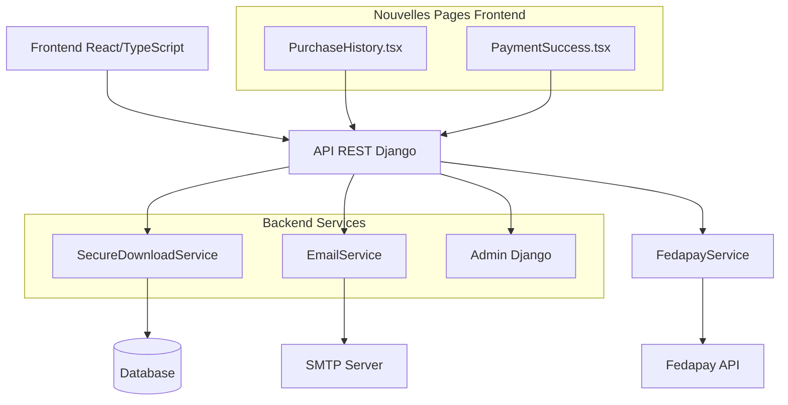
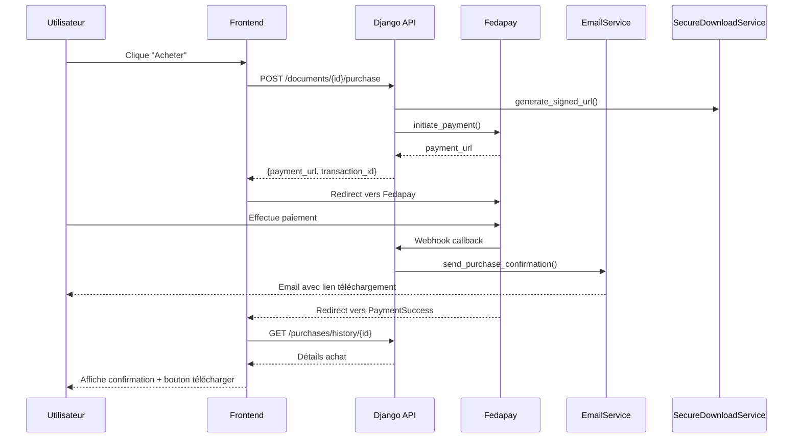
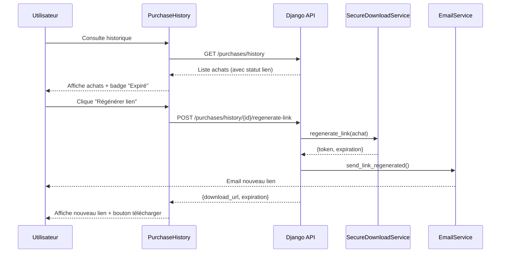

# Design Document: Finalisation Marketplace Documents Techniques

## Overview

Ce design couvre l'implémentation des fonctionnalités manquantes pour finaliser la marketplace de vente de documents techniques agricoles. Le backend Django REST est déjà 80% complet avec les modèles, API et service de téléchargement sécurisé. Ce document se concentre sur les composants frontend critiques (historique des achats, confirmation de paiement), le service d'email, et les améliorations de l'interface admin Django.

Les priorités sont: (1) Pages frontend PurchaseHistory et PaymentSuccess, (2) Service Email pour notifications, (3) Améliorations Admin Django, (4) Tests E2E optionnels.

## Architecture



## Sequence Diagrams

### Flux d'Achat Complet




### Flux de Régénération de Lien



## Components and Interfaces

### Frontend Components

#### 1. PurchaseHistory.tsx

**Purpose**: Afficher l'historique complet des achats de documents avec filtres et actions

**Interface**:
```typescript
interface PurchaseHistoryProps {}

interface Purchase {
  id: number
  document: number
  document_titre: string
  document_culture: string
  document_prix: string
  format_fichier: string
  transaction_id: string
  transaction_statut: 'SUCCESS' | 'PENDING' | 'FAILED'
  lien_telechargement: string
  expiration_lien: string
  lien_expire: boolean
  peut_regenerer: boolean
  nombre_telechargements: number
  created_at: string
}

interface Filters {
  date_debut?: string
  date_fin?: string
  culture?: string
  statut?: string
  lien_expire?: boolean
}
```

**Responsibilities**:
- Récupérer et afficher la liste des achats via GET /api/v1/purchases/history
- Implémenter filtres par date, culture, statut, lien expiré
- Afficher badge de statut (Payé, En attente, Échoué, Lien expiré)
- Bouton "Télécharger" si lien valide
- Bouton "Régénérer lien" si lien expiré et paiement SUCCESS
- Afficher nombre de téléchargements et date d'expiration
- Gestion des états de chargement et erreurs


#### 2. PaymentSuccess.tsx

**Purpose**: Page de confirmation après paiement Fedapay réussi

**Interface**:
```typescript
interface PaymentSuccessProps {}

interface PaymentResult {
  success: boolean
  transaction_id: string
  document: {
    id: number
    titre: string
    culture: string
    prix: string
    format_fichier: string
  }
  download_url: string
  expiration: string
  message: string
}
```

**Responsibilities**:
- Récupérer transaction_id depuis URL params
- Afficher détails du document acheté
- Bouton de téléchargement immédiat avec lien sécurisé
- Afficher date d'expiration du lien (48h)
- Lien vers historique des achats
- Gestion des erreurs de paiement (statut FAILED)
- Animation de succès visuelle

#### 3. Documents.tsx (Améliorations)

**Nouvelles fonctionnalités**:
- Modal de détails avant achat avec preview du template
- Gestion des erreurs Fedapay avec messages clairs
- Loading states améliorés (skeleton cards)
- Indicateur si document déjà acheté
- Toast notifications pour feedback utilisateur

### Backend Services

#### 4. EmailService

**Purpose**: Gérer l'envoi d'emails transactionnels pour la marketplace

**Interface**:
```python
class EmailService:
    @staticmethod
    def send_purchase_confirmation(achat: AchatDocument) -> bool:
        """Envoie email de confirmation d'achat avec lien téléchargement"""
        pass
    
    @staticmethod
    def send_expiration_reminder(achat: AchatDocument) -> bool:
        """Envoie rappel 24h avant expiration du lien"""
        pass
    
    @staticmethod
    def send_link_regenerated(achat: AchatDocument) -> bool:
        """Envoie email avec nouveau lien après régénération"""
        pass
    
    @staticmethod
    def _render_email_template(template_name: str, context: dict) -> str:
        """Rend un template HTML d'email"""
        pass
```

**Responsibilities**:
- Envoyer email de confirmation immédiatement après achat réussi
- Envoyer rappel automatique 24h avant expiration (via Celery task)
- Envoyer email avec nouveau lien après régénération
- Utiliser templates HTML professionnels
- Logger tous les envois d'emails
- Gérer les erreurs d'envoi gracieusement


#### 5. Admin Django (Améliorations)

**Purpose**: Interface d'administration complète pour gérer la marketplace

**Améliorations DocumentTemplateAdmin**:
- Affichage des variables requises en lecture seule
- Action en masse: dupliquer template avec nouvelle version
- Filtres par type_document et format_fichier
- Recherche par titre

**Améliorations DocumentTechniqueAdmin**:
- Filtres par région, culture, actif, template
- Recherche par titre, description, culture
- Action en masse: activer/désactiver documents
- Affichage du nombre d'achats par document
- Lien vers les achats associés

**Améliorations AchatDocumentAdmin**:
- Filtres par statut transaction, lien expiré, date
- Recherche par acheteur, document
- Affichage du statut du lien (valide/expiré)
- Action: régénérer lien pour achats sélectionnés
- Statistiques: total ventes, revenus par période
- Export CSV des achats

**Nouveau: StatistiquesVentesView**:
- Dashboard avec métriques clés
- Graphiques de ventes par période
- Top documents vendus
- Revenus par région/culture

## Data Models

### Existing Models (Reference)

```python
class DocumentTemplate(TimeStampedModel):
    titre = CharField(max_length=200)
    description = TextField()
    type_document = CharField(choices=TYPE_CHOICES)
    format_fichier = CharField(choices=FORMAT_CHOICES)
    fichier_template = FileField(upload_to='templates/')
    variables_requises = JSONField(default=list)
    version = IntegerField(default=1)

class DocumentTechnique(TimeStampedModel):
    template = ForeignKey(DocumentTemplate)
    titre = CharField(max_length=200)
    description = TextField()
    prix = DecimalField(max_digits=10, decimal_places=2)
    region = ForeignKey(Region, null=True)
    prefecture = ForeignKey(Prefecture, null=True)
    canton = ForeignKey(Canton, null=True)
    culture = CharField(max_length=100)
    fichier_genere = FileField(upload_to='documents/')
    actif = BooleanField(default=True)

class AchatDocument(TimeStampedModel):
    acheteur = ForeignKey(User)
    document = ForeignKey(DocumentTechnique)
    transaction = OneToOneField(Transaction)
    lien_telechargement = CharField(max_length=500)
    expiration_lien = DateTimeField(null=True)
    nombre_telechargements = IntegerField(default=0)

class DownloadLog(TimeStampedModel):
    achat = ForeignKey(AchatDocument)
    ip_address = GenericIPAddressField()
    timestamp = DateTimeField(auto_now_add=True)
```

**Validation Rules**:
- DocumentTechnique.prix doit être > 0
- AchatDocument.expiration_lien doit être dans le futur lors de la création
- DownloadLog.ip_address doit être une IP valide (v4 ou v6)
- DocumentTemplate.variables_requises doit être une liste JSON valide


## Algorithmic Pseudocode

### Main Processing Algorithm: Purchase Workflow

```pascal
ALGORITHM processPurchaseWorkflow(user, document_id, callback_url)
INPUT: user (authenticated User), document_id (integer), callback_url (string)
OUTPUT: payment_data (dict with payment_url and transaction_id)

BEGIN
  ASSERT user.is_authenticated = true
  ASSERT document_id > 0
  
  // Step 1: Validate document availability
  document ← DocumentTechnique.objects.get(id=document_id)
  
  IF document.actif = false THEN
    RAISE ValidationError("Document non disponible")
  END IF
  
  // Step 2: Check for existing purchase
  existing_purchase ← AchatDocument.objects.filter(
    acheteur=user,
    document=document,
    transaction__statut='SUCCESS'
  ).first()
  
  IF existing_purchase IS NOT NULL THEN
    // User already owns this document
    download_info ← SecureDownloadService.generate_signed_url(existing_purchase)
    RETURN {
      already_purchased: true,
      download_url: build_download_url(download_info.token),
      expiration: download_info.expiration
    }
  END IF
  
  // Step 3: Create transaction
  transaction ← TransactionService.create_transaction(
    utilisateur=user,
    type_transaction='ACHAT_DOCUMENT',
    montant=document.prix,
    reference_externe=document_id
  )
  
  // Step 4: Create purchase record
  achat ← AchatDocument.objects.create(
    acheteur=user,
    document=document,
    transaction=transaction
  )
  
  // Step 5: Initialize Fedapay payment
  payment_data ← FedapayService.initiate_payment(
    transaction=transaction,
    callback_url=callback_url,
    description="Achat document: " + document.titre
  )
  
  ASSERT payment_data.payment_url IS NOT NULL
  
  LOG("Purchase initiated", {
    document_id: document.id,
    user_id: user.id,
    transaction_id: transaction.id
  })
  
  RETURN {
    success: true,
    transaction_id: transaction.id,
    payment_url: payment_data.payment_url
  }
END
```

**Preconditions**:
- user is authenticated and active
- document_id corresponds to an existing DocumentTechnique
- callback_url is a valid URL (if provided)
- FedapayService is properly configured

**Postconditions**:
- If document already purchased: returns existing download link
- If new purchase: Transaction and AchatDocument created with PENDING status
- Returns valid payment_url for Fedapay checkout
- All database operations are atomic (transaction)

**Loop Invariants**: N/A (no loops in main flow)


### Download Validation Algorithm

```pascal
ALGORITHM validateAndDownload(document_id, token, user, ip_address)
INPUT: document_id (integer), token (string), user (User), ip_address (string)
OUTPUT: file_response (FileResponse) or error

BEGIN
  ASSERT user.is_authenticated = true
  ASSERT token IS NOT NULL AND length(token) > 0
  ASSERT is_valid_ip(ip_address) = true
  
  // Step 1: Validate token and retrieve purchase
  TRY
    achat ← AchatDocument.objects.get(
      document_id=document_id,
      lien_telechargement=token
    )
  CATCH DoesNotExist
    LOG_WARNING("Invalid download token", {document_id, user_id: user.id})
    RAISE ValidationError("Lien de téléchargement invalide")
  END TRY
  
  // Step 2: Verify ownership
  IF achat.acheteur ≠ user THEN
    LOG_WARNING("Unauthorized download attempt", {
      achat_id: achat.id,
      user_id: user.id,
      owner_id: achat.acheteur.id
    })
    RAISE ValidationError("Non autorisé")
  END IF
  
  // Step 3: Verify payment status
  IF achat.transaction.statut ≠ 'SUCCESS' THEN
    LOG_WARNING("Download attempt with unpaid transaction", {
      achat_id: achat.id,
      status: achat.transaction.statut
    })
    RAISE ValidationError("Paiement non confirmé")
  END IF
  
  // Step 4: Check expiration
  IF timezone.now() > achat.expiration_lien THEN
    LOG_INFO("Expired download link", {
      achat_id: achat.id,
      expiration: achat.expiration_lien
    })
    RAISE ValidationError("Lien expiré. Régénérez depuis votre historique.")
  END IF
  
  // Step 5: Track download
  achat.nombre_telechargements ← achat.nombre_telechargements + 1
  achat.save()
  
  DownloadLog.objects.create(
    achat=achat,
    ip_address=ip_address,
    timestamp=timezone.now()
  )
  
  LOG_INFO("Document downloaded", {
    achat_id: achat.id,
    document_id: document_id,
    user_id: user.id,
    ip: ip_address,
    count: achat.nombre_telechargements
  })
  
  // Step 6: Return file
  file_path ← achat.document.fichier_genere.path
  content_type ← determine_content_type(achat.document.template.format_fichier)
  filename ← generate_filename(achat.document.titre, content_type)
  
  RETURN FileResponse(file_path, content_type, filename)
END
```

**Preconditions**:
- user is authenticated
- token is non-empty string
- ip_address is valid IPv4 or IPv6 address
- document_id corresponds to existing document

**Postconditions**:
- If valid: file is returned and download is logged
- If invalid: appropriate error is raised with descriptive message
- Download counter is incremented atomically
- DownloadLog entry is created with timestamp and IP

**Loop Invariants**: N/A (no loops)


### Email Sending Algorithm

```pascal
ALGORITHM sendPurchaseConfirmationEmail(achat)
INPUT: achat (AchatDocument instance)
OUTPUT: success (boolean)

BEGIN
  ASSERT achat IS NOT NULL
  ASSERT achat.transaction.statut = 'SUCCESS'
  ASSERT achat.acheteur.email IS NOT NULL
  
  // Step 1: Generate download link
  download_info ← SecureDownloadService.generate_signed_url(achat)
  download_url ← build_absolute_url(
    '/api/v1/documents/' + achat.document.id + '/download',
    query_params={'token': download_info.token}
  )
  
  // Step 2: Prepare email context
  context ← {
    'user_name': achat.acheteur.get_full_name(),
    'document_titre': achat.document.titre,
    'document_culture': achat.document.culture,
    'document_prix': format_currency(achat.document.prix),
    'download_url': download_url,
    'expiration_date': format_datetime(download_info.expiration),
    'transaction_id': achat.transaction.id,
    'purchase_date': format_datetime(achat.created_at),
    'history_url': build_absolute_url('/purchases/history')
  }
  
  // Step 3: Render HTML email template
  html_content ← render_template('emails/purchase_confirmation.html', context)
  text_content ← render_template('emails/purchase_confirmation.txt', context)
  
  // Step 4: Send email
  TRY
    send_mail(
      subject='Confirmation d\'achat - ' + achat.document.titre,
      message=text_content,
      html_message=html_content,
      from_email=settings.DEFAULT_FROM_EMAIL,
      recipient_list=[achat.acheteur.email],
      fail_silently=False
    )
    
    LOG_INFO("Purchase confirmation email sent", {
      achat_id: achat.id,
      recipient: achat.acheteur.email
    })
    
    RETURN true
    
  CATCH Exception AS e
    LOG_ERROR("Failed to send purchase confirmation email", {
      achat_id: achat.id,
      recipient: achat.acheteur.email,
      error: str(e)
    })
    
    RETURN false
  END TRY
END
```

**Preconditions**:
- achat is valid AchatDocument instance
- achat.transaction.statut is 'SUCCESS'
- achat.acheteur has valid email address
- Email backend is properly configured
- Email templates exist

**Postconditions**:
- If successful: email is sent and logged
- If failed: error is logged but does not raise exception
- Returns boolean indicating success/failure
- Download link in email is valid for 48 hours

**Loop Invariants**: N/A (no loops)


## Key Functions with Formal Specifications

### Frontend Function: fetchPurchaseHistory()

```typescript
async function fetchPurchaseHistory(filters: Filters): Promise<Purchase[]>
```

**Preconditions:**
- User is authenticated (access_token exists in localStorage)
- filters object is well-formed (optional fields)
- API endpoint /api/v1/purchases/history is available

**Postconditions:**
- Returns array of Purchase objects
- If no purchases: returns empty array
- If error: throws Error with descriptive message
- Purchases are sorted by created_at descending

**Loop Invariants:** N/A (async operation)

### Frontend Function: regenerateDownloadLink()

```typescript
async function regenerateDownloadLink(purchaseId: number): Promise<RegenerateResult>
```

**Preconditions:**
- User is authenticated
- purchaseId is positive integer
- Purchase exists and belongs to user
- Purchase transaction status is 'SUCCESS'

**Postconditions:**
- Returns new download_url and expiration timestamp
- New link is valid for 48 hours from regeneration time
- If error: throws Error with descriptive message
- Old link is invalidated

**Loop Invariants:** N/A (async operation)

### Backend Function: EmailService.send_purchase_confirmation()

```python
@staticmethod
def send_purchase_confirmation(achat: AchatDocument) -> bool
```

**Preconditions:**
- achat is valid AchatDocument instance
- achat.transaction.statut == 'SUCCESS'
- achat.acheteur.email is not None and is valid email
- Email backend configured in settings

**Postconditions:**
- Returns True if email sent successfully
- Returns False if sending failed (does not raise exception)
- Email contains valid download link
- Sending attempt is logged

**Loop Invariants:** N/A (no loops)

### Backend Function: SecureDownloadService.regenerate_link()

```python
@staticmethod
def regenerate_link(achat: AchatDocument) -> Dict[str, any]
```

**Preconditions:**
- achat is valid AchatDocument instance
- achat.transaction.statut == 'SUCCESS'

**Postconditions:**
- Returns dict with new token, expiration, document_id, achat_id
- achat.lien_telechargement is updated with new token
- achat.expiration_lien is set to now + 48 hours
- Old token is invalidated
- Changes are persisted to database

**Loop Invariants:** N/A (no loops)


## Example Usage

### Frontend: PurchaseHistory Component

```typescript
// Example 1: Fetch and display purchase history
const PurchaseHistory: React.FC = () => {
  const [purchases, setPurchases] = useState<Purchase[]>([])
  const [loading, setLoading] = useState(true)
  const [filters, setFilters] = useState<Filters>({})

  useEffect(() => {
    const fetchData = async () => {
      try {
        const token = localStorage.getItem('access_token')
        const params = new URLSearchParams()
        
        if (filters.date_debut) params.append('date_debut', filters.date_debut)
        if (filters.culture) params.append('culture', filters.culture)
        if (filters.lien_expire !== undefined) {
          params.append('lien_expire', filters.lien_expire.toString())
        }
        
        const response = await axios.get(
          `http://localhost:8000/api/v1/purchases/history?${params}`,
          { headers: { Authorization: `Bearer ${token}` } }
        )
        
        setPurchases(response.data.results || [])
      } catch (error) {
        console.error('Erreur chargement historique:', error)
        toast.error('Impossible de charger l\'historique')
      } finally {
        setLoading(false)
      }
    }
    
    fetchData()
  }, [filters])

  return (
    <div className="purchase-history">
      <h1>📚 Mes Achats de Documents</h1>
      <FilterBar filters={filters} onChange={setFilters} />
      <PurchaseList purchases={purchases} loading={loading} />
    </div>
  )
}

// Example 2: Regenerate expired link
const handleRegenerateLink = async (purchaseId: number) => {
  try {
    const token = localStorage.getItem('access_token')
    const response = await axios.post(
      `http://localhost:8000/api/v1/purchases/history/${purchaseId}/regenerate-link`,
      {},
      { headers: { Authorization: `Bearer ${token}` } }
    )
    
    toast.success('Nouveau lien généré avec succès!')
    // Update purchase in state
    setPurchases(prev => prev.map(p => 
      p.id === purchaseId 
        ? { ...p, lien_expire: false, expiration_lien: response.data.expiration }
        : p
    ))
  } catch (error) {
    toast.error('Erreur lors de la régénération du lien')
  }
}

// Example 3: Download document
const handleDownload = (purchase: Purchase) => {
  const downloadUrl = `http://localhost:8000/api/v1/documents/${purchase.document}/download?token=${purchase.lien_telechargement}`
  window.open(downloadUrl, '_blank')
}
```


### Frontend: PaymentSuccess Component

```typescript
// Example: Payment success page with immediate download
const PaymentSuccess: React.FC = () => {
  const [paymentData, setPaymentData] = useState<PaymentResult | null>(null)
  const [loading, setLoading] = useState(true)
  const navigate = useNavigate()
  const searchParams = new URLSearchParams(window.location.search)
  const transactionId = searchParams.get('transaction_id')

  useEffect(() => {
    const verifyPayment = async () => {
      if (!transactionId) {
        navigate('/documents')
        return
      }

      try {
        const token = localStorage.getItem('access_token')
        const response = await axios.get(
          `http://localhost:8000/api/v1/purchases/verify/${transactionId}`,
          { headers: { Authorization: `Bearer ${token}` } }
        )
        
        if (response.data.success) {
          setPaymentData(response.data)
        } else {
          toast.error('Paiement échoué')
          navigate('/documents')
        }
      } catch (error) {
        console.error('Erreur vérification paiement:', error)
        navigate('/documents')
      } finally {
        setLoading(false)
      }
    }

    verifyPayment()
  }, [transactionId, navigate])

  if (loading) return <Loading />

  return (
    <div className="payment-success">
      <div className="success-icon">✅</div>
      <h1>Paiement Réussi!</h1>
      <p>Votre document est maintenant disponible</p>
      
      <div className="document-info">
        <h2>{paymentData?.document.titre}</h2>
        <p>Culture: {paymentData?.document.culture}</p>
        <p>Prix: {paymentData?.document.prix} FCFA</p>
      </div>
      
      <button 
        onClick={() => window.open(paymentData?.download_url, '_blank')}
        className="download-btn-primary"
      >
        📥 Télécharger Maintenant
      </button>
      
      <p className="expiration-notice">
        Lien valide jusqu'au {formatDate(paymentData?.expiration)}
      </p>
      
      <button 
        onClick={() => navigate('/purchases/history')}
        className="history-link"
      >
        Voir mon historique d'achats
      </button>
    </div>
  )
}
```


### Backend: EmailService Implementation

```python
# Example 1: Send purchase confirmation email
from django.core.mail import send_mail
from django.template.loader import render_to_string
from django.conf import settings
import logging

logger = logging.getLogger(__name__)

class EmailService:
    @staticmethod
    def send_purchase_confirmation(achat: AchatDocument) -> bool:
        """Send purchase confirmation email with download link"""
        try:
            # Generate download link
            download_info = SecureDownloadService.generate_signed_url(achat)
            download_url = settings.FRONTEND_URL + \
                f'/documents/{achat.document.id}/download?token={download_info["token"]}'
            
            # Prepare context
            context = {
                'user_name': achat.acheteur.get_full_name(),
                'document_titre': achat.document.titre,
                'document_culture': achat.document.culture,
                'document_prix': f'{achat.document.prix:,.0f}',
                'download_url': download_url,
                'expiration_date': download_info['expiration'].strftime('%d/%m/%Y %H:%M'),
                'transaction_id': str(achat.transaction.id),
                'purchase_date': achat.created_at.strftime('%d/%m/%Y %H:%M'),
                'history_url': settings.FRONTEND_URL + '/purchases/history'
            }
            
            # Render templates
            html_content = render_to_string(
                'emails/purchase_confirmation.html',
                context
            )
            text_content = render_to_string(
                'emails/purchase_confirmation.txt',
                context
            )
            
            # Send email
            send_mail(
                subject=f'Confirmation d\'achat - {achat.document.titre}',
                message=text_content,
                html_message=html_content,
                from_email=settings.DEFAULT_FROM_EMAIL,
                recipient_list=[achat.acheteur.email],
                fail_silently=False
            )
            
            logger.info(
                f"Purchase confirmation email sent: achat_id={achat.id}, "
                f"recipient={achat.acheteur.email}"
            )
            return True
            
        except Exception as e:
            logger.error(
                f"Failed to send purchase confirmation email: "
                f"achat_id={achat.id}, error={str(e)}"
            )
            return False

# Example 2: Send expiration reminder (Celery task)
from celery import shared_task
from datetime import timedelta
from django.utils import timezone

@shared_task
def send_expiration_reminders():
    """Send reminders for links expiring in 24 hours"""
    tomorrow = timezone.now() + timedelta(hours=24)
    expiring_soon = AchatDocument.objects.filter(
        transaction__statut='SUCCESS',
        expiration_lien__lte=tomorrow,
        expiration_lien__gte=timezone.now(),
        nombre_telechargements=0  # Not yet downloaded
    )
    
    for achat in expiring_soon:
        EmailService.send_expiration_reminder(achat)
```


### Backend: Admin Django Improvements

```python
# Example: Enhanced AchatDocumentAdmin with statistics
from django.contrib import admin
from django.db.models import Count, Sum, Q
from django.utils.html import format_html
from django.urls import reverse
from django.utils import timezone

@admin.register(AchatDocument)
class AchatDocumentAdmin(admin.ModelAdmin):
    list_display = [
        'id',
        'acheteur_link',
        'document_link',
        'montant',
        'statut_badge',
        'lien_statut',
        'nombre_telechargements',
        'created_at'
    ]
    list_filter = [
        'transaction__statut',
        'created_at',
        ('expiration_lien', admin.DateFieldListFilter),
        'document__culture',
        'document__region'
    ]
    search_fields = [
        'acheteur__email',
        'acheteur__first_name',
        'acheteur__last_name',
        'document__titre',
        'transaction__id'
    ]
    readonly_fields = [
        'transaction',
        'lien_telechargement',
        'expiration_lien',
        'nombre_telechargements',
        'created_at',
        'updated_at'
    ]
    actions = ['regenerate_links', 'export_to_csv']
    
    def acheteur_link(self, obj):
        url = reverse('admin:users_user_change', args=[obj.acheteur.id])
        return format_html('<a href="{}">{}</a>', url, obj.acheteur.get_full_name())
    acheteur_link.short_description = 'Acheteur'
    
    def document_link(self, obj):
        url = reverse('admin:documents_documenttechnique_change', args=[obj.document.id])
        return format_html('<a href="{}">{}</a>', url, obj.document.titre)
    document_link.short_description = 'Document'
    
    def montant(self, obj):
        return f'{obj.document.prix:,.0f} FCFA'
    montant.short_description = 'Montant'
    
    def statut_badge(self, obj):
        colors = {
            'SUCCESS': 'green',
            'PENDING': 'orange',
            'FAILED': 'red'
        }
        color = colors.get(obj.transaction.statut, 'gray')
        return format_html(
            '<span style="background-color: {}; color: white; '
            'padding: 3px 10px; border-radius: 3px;">{}</span>',
            color,
            obj.transaction.statut
        )
    statut_badge.short_description = 'Statut'
    
    def lien_statut(self, obj):
        if not obj.expiration_lien:
            return format_html('<span style="color: gray;">Non généré</span>')
        
        is_expired = timezone.now() > obj.expiration_lien
        if is_expired:
            return format_html('<span style="color: red;">⚠️ Expiré</span>')
        else:
            return format_html('<span style="color: green;">✓ Valide</span>')
    lien_statut.short_description = 'Lien'
    
    def regenerate_links(self, request, queryset):
        """Action to regenerate download links for selected purchases"""
        count = 0
        for achat in queryset.filter(transaction__statut='SUCCESS'):
            SecureDownloadService.regenerate_link(achat)
            count += 1
        
        self.message_user(request, f'{count} lien(s) régénéré(s) avec succès')
    regenerate_links.short_description = 'Régénérer les liens de téléchargement'
    
    def changelist_view(self, request, extra_context=None):
        """Add statistics to the changelist view"""
        extra_context = extra_context or {}
        
        # Calculate statistics
        stats = AchatDocument.objects.aggregate(
            total_ventes=Count('id', filter=Q(transaction__statut='SUCCESS')),
            revenus_total=Sum('document__prix', filter=Q(transaction__statut='SUCCESS')),
            total_telechargements=Sum('nombre_telechargements')
        )
        
        extra_context['stats'] = stats
        return super().changelist_view(request, extra_context)
```


## Correctness Properties

### Universal Quantification Statements

**Property 1: Download Link Security**
```
∀ achat ∈ AchatDocument:
  (achat.lien_telechargement ≠ NULL) ⟹
  (length(achat.lien_telechargement) ≥ 32 ∧
   is_url_safe(achat.lien_telechargement) = true ∧
   is_unique(achat.lien_telechargement) = true)
```
Every download link must be at least 32 characters, URL-safe, and globally unique.

**Property 2: Link Expiration Validity**
```
∀ achat ∈ AchatDocument:
  (achat.expiration_lien ≠ NULL) ⟹
  (achat.expiration_lien = achat.updated_at + 48_hours ∧
   achat.expiration_lien > achat.created_at)
```
Every expiration timestamp must be exactly 48 hours from last update and after creation.

**Property 3: Payment Before Download**
```
∀ achat ∈ AchatDocument:
  (achat.nombre_telechargements > 0) ⟹
  (achat.transaction.statut = 'SUCCESS')
```
A document can only be downloaded if payment was successful.

**Property 4: Ownership Verification**
```
∀ download_request ∈ DownloadRequest:
  allow_download(download_request) ⟹
  (download_request.user = achat.acheteur ∧
   achat.transaction.statut = 'SUCCESS' ∧
   timezone.now() ≤ achat.expiration_lien)
```
Downloads are only allowed for the owner with valid payment and non-expired link.

**Property 5: Email Notification Guarantee**
```
∀ achat ∈ AchatDocument:
  (achat.transaction.statut = 'SUCCESS') ⟹
  (email_sent(achat.acheteur.email, 'purchase_confirmation') = true ∨
   email_logged_as_failed(achat.id) = true)
```
Every successful purchase triggers an email attempt that is either sent or logged as failed.

**Property 6: Download Tracking Completeness**
```
∀ successful_download ∈ DownloadEvent:
  ∃ log ∈ DownloadLog:
    (log.achat = successful_download.achat ∧
     log.ip_address = successful_download.ip ∧
     log.timestamp = successful_download.timestamp)
```
Every successful download creates a corresponding log entry.

**Property 7: Link Regeneration Idempotency**
```
∀ achat ∈ AchatDocument:
  (regenerate_link(achat) ∧ regenerate_link(achat)) ⟹
  (second_token ≠ first_token ∧
   both_valid_for_48_hours = true)
```
Regenerating a link multiple times produces different tokens, each valid for 48 hours.

**Property 8: Purchase Uniqueness Per User-Document**
```
∀ user ∈ User, document ∈ DocumentTechnique:
  count(AchatDocument.filter(
    acheteur=user,
    document=document,
    transaction__statut='SUCCESS'
  )) ≤ 1
```
A user can have at most one successful purchase per document (prevents duplicate purchases).


## Error Handling

### Error Scenario 1: Expired Download Link

**Condition**: User attempts to download with expired token (timezone.now() > expiration_lien)

**Response**: 
- Backend returns 403 Forbidden with message "Lien expiré"
- Frontend displays error toast with regeneration option
- User redirected to purchase history page

**Recovery**:
- User clicks "Régénérer lien" button
- POST /purchases/history/{id}/regenerate-link
- New link generated with fresh 48h validity
- Email sent with new link
- User can immediately download

### Error Scenario 2: Fedapay Payment Failure

**Condition**: Payment declined or cancelled by user

**Response**:
- Fedapay redirects to callback URL with status=FAILED
- Backend updates transaction status to FAILED
- Frontend displays PaymentFailure page with error details
- No download link generated

**Recovery**:
- User can retry purchase from Documents page
- New transaction created for retry attempt
- Previous failed transaction remains in history for audit

### Error Scenario 3: Email Sending Failure

**Condition**: SMTP server unavailable or email address invalid

**Response**:
- EmailService.send_purchase_confirmation() returns False
- Error logged with achat_id and error details
- Purchase still completes successfully
- User can access download from history page

**Recovery**:
- Admin can manually trigger email resend from Django admin
- User receives download link via purchase history page
- Celery retry mechanism attempts resend after 5 minutes

### Error Scenario 4: Unauthorized Download Attempt

**Condition**: User tries to download document they didn't purchase (wrong token or different user)

**Response**:
- Backend validates achat.acheteur == request.user
- Returns 403 Forbidden with "Non autorisé"
- Logs security warning with user IDs and IP address

**Recovery**:
- User must purchase document themselves
- No recovery possible (security measure)
- Admin alerted if multiple attempts from same IP

### Error Scenario 5: Document No Longer Available

**Condition**: User attempts to purchase document with actif=False

**Response**:
- Backend checks document.actif before creating transaction
- Returns 400 Bad Request with "Document non disponible"
- Frontend displays error message

**Recovery**:
- User can browse other available documents
- Admin can reactivate document if appropriate
- Existing purchases remain valid even if document deactivated


## Testing Strategy

### Unit Testing Approach

**Backend Unit Tests** (Django TestCase):

1. **SecureDownloadService Tests**:
   - test_generate_download_token_length: Verify token is 32+ chars
   - test_generate_signed_url_creates_token: Verify token creation
   - test_is_link_expired_with_expired_link: Verify expiration detection
   - test_validate_download_token_success: Valid token returns achat
   - test_validate_download_token_wrong_user: Raises ValidationError
   - test_validate_download_token_unpaid: Raises ValidationError for non-SUCCESS
   - test_regenerate_link_creates_new_token: Verify new token differs from old

2. **EmailService Tests**:
   - test_send_purchase_confirmation_success: Email sent with correct content
   - test_send_purchase_confirmation_invalid_email: Handles invalid email
   - test_send_expiration_reminder: Reminder sent 24h before expiration
   - test_send_link_regenerated: Email sent after regeneration
   - test_email_template_rendering: Templates render with correct context

3. **ViewSet Tests**:
   - test_purchase_creates_transaction: POST /purchase creates Transaction
   - test_purchase_already_owned: Returns existing download link
   - test_purchase_inactive_document: Returns 400 error
   - test_download_with_valid_token: Returns file
   - test_download_with_expired_token: Returns 403
   - test_regenerate_link_success: POST /regenerate-link returns new link
   - test_purchase_history_filters: Filters work correctly

**Frontend Unit Tests** (Jest + React Testing Library):

1. **PurchaseHistory Component Tests**:
   - test_renders_purchase_list: Displays purchases correctly
   - test_filters_apply_correctly: URL params updated on filter change
   - test_regenerate_button_visible_when_expired: Button shown for expired links
   - test_download_button_opens_new_tab: Download opens in new window
   - test_loading_state_displayed: Shows spinner while loading
   - test_empty_state_displayed: Shows message when no purchases

2. **PaymentSuccess Component Tests**:
   - test_fetches_payment_data_on_mount: API called with transaction_id
   - test_displays_document_info: Document details rendered
   - test_download_button_functional: Download button triggers download
   - test_redirects_on_failed_payment: Navigates away on failure
   - test_redirects_without_transaction_id: Navigates to /documents

3. **Documents Component Tests**:
   - test_purchase_modal_opens: Modal displays on "Acheter" click
   - test_already_purchased_indicator: Shows badge if already owned
   - test_error_handling_on_purchase_failure: Toast shown on error


### Property-Based Testing Approach

**Property Test Library**: Hypothesis (Python) for backend, fast-check (TypeScript) for frontend

**Backend Property Tests**:

1. **Property: Token Uniqueness**
```python
from hypothesis import given, strategies as st

@given(st.integers(min_value=1, max_value=1000))
def test_generated_tokens_are_unique(n):
    """Generate n tokens and verify all are unique"""
    tokens = [SecureDownloadService.generate_download_token() for _ in range(n)]
    assert len(tokens) == len(set(tokens))
```

2. **Property: Link Expiration Consistency**
```python
@given(st.datetimes(min_value=datetime(2024, 1, 1)))
def test_expiration_always_48_hours_from_generation(generation_time):
    """Expiration is always exactly 48 hours from generation"""
    with freeze_time(generation_time):
        achat = create_test_achat()
        download_info = SecureDownloadService.generate_signed_url(achat)
        
        expected_expiration = generation_time + timedelta(hours=48)
        assert download_info['expiration'] == expected_expiration
```

3. **Property: Download Authorization Invariant**
```python
@given(
    st.integers(min_value=1, max_value=100),  # user_id
    st.integers(min_value=1, max_value=100),  # owner_id
    st.text(min_size=32, max_size=64)  # token
)
def test_download_only_allowed_for_owner(user_id, owner_id, token):
    """Downloads only succeed when user is the owner"""
    achat = create_test_achat(owner_id=owner_id, token=token)
    user = create_test_user(id=user_id)
    
    if user_id == owner_id:
        # Should succeed
        result = SecureDownloadService.validate_download_token(
            achat.document.id, token, user
        )
        assert result == achat
    else:
        # Should fail
        with pytest.raises(ValidationError):
            SecureDownloadService.validate_download_token(
                achat.document.id, token, user
            )
```

**Frontend Property Tests**:

1. **Property: Filter Combinations Produce Valid URLs**
```typescript
import fc from 'fast-check'

test('all filter combinations produce valid API URLs', () => {
  fc.assert(
    fc.property(
      fc.record({
        date_debut: fc.option(fc.date()),
        date_fin: fc.option(fc.date()),
        culture: fc.option(fc.string()),
        statut: fc.option(fc.constantFrom('SUCCESS', 'PENDING', 'FAILED')),
        lien_expire: fc.option(fc.boolean())
      }),
      (filters) => {
        const url = buildPurchaseHistoryUrl(filters)
        expect(url).toMatch(/^http:\/\/localhost:8000\/api\/v1\/purchases\/history/)
        expect(() => new URL(url)).not.toThrow()
      }
    )
  )
})
```

2. **Property: Purchase List Sorting Invariant**
```typescript
test('purchases are always sorted by date descending', () => {
  fc.assert(
    fc.property(
      fc.array(fc.record({
        id: fc.integer(),
        created_at: fc.date().map(d => d.toISOString())
      }), { minLength: 2, maxLength: 50 }),
      (purchases) => {
        const sorted = sortPurchasesByDate(purchases)
        
        for (let i = 0; i < sorted.length - 1; i++) {
          const current = new Date(sorted[i].created_at)
          const next = new Date(sorted[i + 1].created_at)
          expect(current.getTime()).toBeGreaterThanOrEqual(next.getTime())
        }
      }
    )
  )
})
```


### Integration Testing Approach

**E2E Tests with Playwright** (Optional but recommended):

1. **Complete Purchase Flow Test**:
```typescript
test('complete purchase and download flow', async ({ page }) => {
  // Step 1: Login
  await page.goto('http://localhost:3000/login')
  await page.fill('input[name="email"]', 'test@example.com')
  await page.fill('input[name="password"]', 'password123')
  await page.click('button[type="submit"]')
  
  // Step 2: Browse documents
  await page.goto('http://localhost:3000/documents')
  await page.waitForSelector('.document-card')
  
  // Step 3: Purchase document
  await page.click('.document-card:first-child .purchase-btn')
  
  // Step 4: Complete Fedapay payment (sandbox)
  await page.waitForURL(/checkout\.fedapay\.com/)
  await page.fill('input[name="card_number"]', '4111111111111111')
  await page.fill('input[name="expiry"]', '12/25')
  await page.fill('input[name="cvv"]', '123')
  await page.click('button[type="submit"]')
  
  // Step 5: Verify redirect to success page
  await page.waitForURL(/payment-success/)
  await expect(page.locator('.success-icon')).toBeVisible()
  await expect(page.locator('h1')).toContainText('Paiement Réussi')
  
  // Step 6: Download document
  const downloadPromise = page.waitForEvent('download')
  await page.click('.download-btn-primary')
  const download = await downloadPromise
  expect(download.suggestedFilename()).toMatch(/\.(xlsx|docx)$/)
  
  // Step 7: Verify in purchase history
  await page.goto('http://localhost:3000/purchases/history')
  await expect(page.locator('.purchase-card:first-child')).toBeVisible()
  await expect(page.locator('.status-badge')).toContainText('Payé')
})

test('regenerate expired download link', async ({ page }) => {
  // Setup: Create expired purchase in database
  await setupExpiredPurchase('test@example.com', 'document-123')
  
  // Step 1: Login and go to history
  await loginAs(page, 'test@example.com')
  await page.goto('http://localhost:3000/purchases/history')
  
  // Step 2: Verify expired badge shown
  await expect(page.locator('.expired-badge')).toBeVisible()
  
  // Step 3: Regenerate link
  await page.click('.regenerate-link-btn')
  await page.waitForSelector('.toast-success')
  
  // Step 4: Verify new link works
  await expect(page.locator('.expired-badge')).not.toBeVisible()
  await expect(page.locator('.download-btn')).toBeEnabled()
  
  // Step 5: Download with new link
  const downloadPromise = page.waitForEvent('download')
  await page.click('.download-btn')
  const download = await downloadPromise
  expect(download).toBeTruthy()
})

test('filter purchase history', async ({ page }) => {
  await loginAs(page, 'test@example.com')
  await page.goto('http://localhost:3000/purchases/history')
  
  // Filter by culture
  await page.selectOption('select[name="culture"]', 'Maïs')
  await page.waitForLoadState('networkidle')
  
  const cards = await page.locator('.purchase-card').all()
  for (const card of cards) {
    await expect(card.locator('.culture')).toContainText('Maïs')
  }
  
  // Filter by expired links
  await page.check('input[name="lien_expire"]')
  await page.waitForLoadState('networkidle')
  
  const expiredCards = await page.locator('.purchase-card').all()
  for (const card of expiredCards) {
    await expect(card.locator('.expired-badge')).toBeVisible()
  }
})
```

2. **Email Verification Test** (with MailHog):
```python
def test_purchase_sends_confirmation_email(client, user, document):
    """Verify email is sent after successful purchase"""
    # Make purchase
    response = client.post(
        f'/api/v1/documents/{document.id}/purchase',
        HTTP_AUTHORIZATION=f'Bearer {user.access_token}'
    )
    
    # Simulate Fedapay callback
    transaction_id = response.json()['transaction_id']
    simulate_fedapay_success(transaction_id)
    
    # Check MailHog for email
    mailhog = MailHogClient('http://localhost:8025')
    emails = mailhog.get_messages()
    
    assert len(emails) == 1
    email = emails[0]
    assert email['to'] == user.email
    assert 'Confirmation d\'achat' in email['subject']
    assert document.titre in email['body']
    assert 'télécharger' in email['body'].lower()
```


## Performance Considerations

### Caching Strategy

**Redis Caching for Document Listings**:
- Cache document list queries for 5 minutes (already implemented)
- Cache document detail views for 10 minutes (already implemented)
- Invalidate cache on document update/creation
- Cache key includes filter parameters for granular invalidation

**Purchase History Optimization**:
- Use select_related() for document, transaction, template relationships
- Paginate results (default 20 per page)
- Cache user's purchase count for quick "already purchased" checks
- Index on (acheteur, created_at) for fast filtering

### Database Query Optimization

**Indexes**:
```python
# Already exists
class Meta:
    indexes = [
        models.Index(fields=['acheteur', 'created_at']),
        models.Index(fields=['culture', 'canton']),
        models.Index(fields=['actif']),
    ]

# Additional recommended indexes
class AchatDocument(TimeStampedModel):
    class Meta:
        indexes = [
            models.Index(fields=['acheteur', 'created_at']),
            models.Index(fields=['transaction', 'created_at']),
            models.Index(fields=['expiration_lien']),  # For expiration queries
        ]
```

**Query Optimization**:
- Use select_related() for foreign keys (document, transaction, acheteur)
- Use prefetch_related() for reverse relationships if needed
- Avoid N+1 queries in purchase history list
- Use only() to fetch specific fields when full object not needed

### File Serving Performance

**Static File Serving**:
- Use X-Accel-Redirect (Nginx) or X-Sendfile (Apache) for file downloads
- Offload file serving from Django to web server
- Reduces memory usage and improves throughput

**Example Nginx Configuration**:
```nginx
location /protected/documents/ {
    internal;
    alias /path/to/media/documents/;
}
```

**Django View Update**:
```python
def download(self, request, pk=None):
    # ... validation code ...
    
    # Use X-Accel-Redirect for Nginx
    response = HttpResponse()
    response['X-Accel-Redirect'] = f'/protected/documents/{document.fichier_genere.name}'
    response['Content-Type'] = content_type
    response['Content-Disposition'] = f'attachment; filename="{filename}"'
    
    return response
```

### Email Sending Performance

**Async Email Sending with Celery**:
- Send emails asynchronously to avoid blocking HTTP requests
- Retry failed emails with exponential backoff
- Queue emails during high traffic periods

```python
@shared_task(bind=True, max_retries=3)
def send_purchase_confirmation_async(self, achat_id):
    try:
        achat = AchatDocument.objects.get(id=achat_id)
        EmailService.send_purchase_confirmation(achat)
    except Exception as exc:
        # Retry after 5 minutes
        raise self.retry(exc=exc, countdown=300)
```

### Frontend Performance

**Code Splitting**:
- Lazy load PurchaseHistory and PaymentSuccess components
- Reduce initial bundle size

```typescript
const PurchaseHistory = lazy(() => import('./pages/PurchaseHistory'))
const PaymentSuccess = lazy(() => import('./pages/PaymentSuccess'))
```

**Optimistic UI Updates**:
- Update UI immediately on regenerate link click
- Revert if API call fails
- Improves perceived performance

**Debounced Filters**:
- Debounce filter input changes (300ms)
- Reduces API calls during typing


## Security Considerations

### Download Link Security

**Token Generation**:
- Use secrets.token_urlsafe(32) for cryptographically secure tokens
- Minimum 32 characters (256 bits of entropy)
- URL-safe encoding (no special characters)
- Globally unique across all purchases

**Token Validation**:
- Verify token matches database record
- Check user ownership (achat.acheteur == request.user)
- Verify payment status (transaction.statut == 'SUCCESS')
- Check expiration timestamp
- Log all validation failures with IP address

**Rate Limiting**:
```python
from django.core.cache import cache
from rest_framework.throttling import UserRateThrottle

class DownloadRateThrottle(UserRateThrottle):
    rate = '10/hour'  # Max 10 downloads per hour per user

class DocumentTechniqueViewSet(viewsets.ReadOnlyModelViewSet):
    @action(detail=True, methods=['get'], throttle_classes=[DownloadRateThrottle])
    def download(self, request, pk=None):
        # ... download logic ...
```

### Payment Security

**Fedapay Integration**:
- Verify webhook signatures from Fedapay
- Use HTTPS for all payment callbacks
- Store transaction IDs, never card details
- Validate transaction status before granting access

**CSRF Protection**:
- Django CSRF tokens for all POST requests
- Exempt Fedapay webhook endpoint from CSRF (verify signature instead)

### Email Security

**Prevent Email Injection**:
- Validate email addresses before sending
- Sanitize user-provided content in emails
- Use Django's built-in email validation

**SPF/DKIM Configuration**:
- Configure SPF records for sending domain
- Enable DKIM signing for email authentication
- Reduces spam classification

### Admin Security

**Access Control**:
- Require staff status for admin access
- Use Django's permission system
- Log all admin actions (Django Admin Log)
- Implement 2FA for admin users (optional)

**Sensitive Data Protection**:
- Mask download tokens in admin interface
- Restrict access to user email addresses
- Audit log for sensitive operations (regenerate links, export data)

### Data Privacy (GDPR Compliance)

**User Data Rights**:
- Allow users to export their purchase history
- Implement data deletion on account closure
- Anonymize download logs after 90 days

**Data Retention Policy**:
```python
# Celery task to anonymize old logs
@shared_task
def anonymize_old_download_logs():
    """Anonymize IP addresses in logs older than 90 days"""
    cutoff_date = timezone.now() - timedelta(days=90)
    
    DownloadLog.objects.filter(
        timestamp__lt=cutoff_date
    ).update(
        ip_address='0.0.0.0'  # Anonymized
    )
```

### Input Validation

**Frontend Validation**:
- Validate all form inputs before submission
- Sanitize user input to prevent XSS
- Use TypeScript for type safety

**Backend Validation**:
- Validate all API inputs with DRF serializers
- Use Django's built-in validators
- Sanitize file uploads (check MIME types)
- Limit file sizes for uploads


## Dependencies

### Backend Dependencies (Python)

**Existing Dependencies** (already in requirements.txt):
- Django 4.2+
- djangorestframework
- django-filter
- django-cors-headers
- psycopg2-binary (PostgreSQL)
- redis
- celery
- python-fedapay

**New Dependencies Required**:
```txt
# Email templates
django-templated-email==3.0.1

# HTML email rendering
premailer==3.10.0  # Inline CSS for email compatibility

# Testing
hypothesis==6.92.0  # Property-based testing
playwright==1.40.0  # E2E testing (optional)
pytest-django==4.7.0
pytest-cov==4.1.0
factory-boy==3.3.0  # Test fixtures

# Monitoring (optional)
sentry-sdk==1.39.0  # Error tracking
```

### Frontend Dependencies (TypeScript/React)

**Existing Dependencies** (already in package.json):
- React 18
- TypeScript
- axios
- react-router-dom
- vite

**New Dependencies Required**:
```json
{
  "dependencies": {
    "react-toastify": "^9.1.3",
    "date-fns": "^2.30.0",
    "react-loading-skeleton": "^3.3.1"
  },
  "devDependencies": {
    "@testing-library/react": "^14.1.2",
    "@testing-library/jest-dom": "^6.1.5",
    "@testing-library/user-event": "^14.5.1",
    "fast-check": "^3.15.0",
    "vitest": "^1.0.4",
    "@playwright/test": "^1.40.0"
  }
}
```

### External Services

**Fedapay** (already integrated):
- Payment gateway for FCFA transactions
- Sandbox environment for testing
- Webhook for payment confirmations

**Email Service**:
- SMTP server (Gmail, SendGrid, Mailgun, or AWS SES)
- Configuration in Django settings:
```python
EMAIL_BACKEND = 'django.core.mail.backends.smtp.EmailBackend'
EMAIL_HOST = 'smtp.gmail.com'
EMAIL_PORT = 587
EMAIL_USE_TLS = True
EMAIL_HOST_USER = 'your-email@gmail.com'
EMAIL_HOST_PASSWORD = 'your-app-password'
DEFAULT_FROM_EMAIL = 'Haroo Platform <noreply@haroo.tg>'
```

**Redis** (already configured):
- Caching for document listings
- Celery message broker
- Session storage

**Celery** (needs configuration):
- Async task processing
- Email sending
- Scheduled tasks (expiration reminders)

**MailHog** (optional, for testing):
- Local email testing
- Captures all outgoing emails
- Web UI at http://localhost:8025

### Infrastructure Requirements

**Web Server**:
- Nginx or Apache with X-Sendfile support
- SSL/TLS certificate for HTTPS
- Reverse proxy configuration

**Database**:
- PostgreSQL 12+ (already configured)
- Regular backups
- Connection pooling (pgbouncer recommended)

**File Storage**:
- Local filesystem (development)
- AWS S3 or compatible (production recommended)
- Backup strategy for uploaded documents

**Monitoring** (optional but recommended):
- Sentry for error tracking
- Prometheus + Grafana for metrics
- ELK stack for log aggregation


## Implementation Priority and Roadmap

### Phase 1: Critical Frontend Pages (Priority 1)

**Estimated Time**: 3-4 days

**Tasks**:
1. Create PurchaseHistory.tsx component
   - Implement purchase list display
   - Add filter sidebar (date, culture, status, expired)
   - Implement regenerate link functionality
   - Add download button with token handling
   - Style with documents.css patterns

2. Create PaymentSuccess.tsx component
   - Implement payment verification
   - Display document details
   - Add immediate download button
   - Handle payment failure scenarios
   - Add navigation to purchase history

3. Update Documents.tsx
   - Add purchase confirmation modal
   - Implement "already purchased" indicator
   - Improve error handling with toast notifications
   - Add loading skeletons

**Deliverables**:
- Functional purchase history page with all filters
- Payment success page with download capability
- Enhanced documents page with better UX

### Phase 2: Email Service (Priority 2)

**Estimated Time**: 2-3 days

**Tasks**:
1. Create EmailService class
   - Implement send_purchase_confirmation()
   - Implement send_expiration_reminder()
   - Implement send_link_regenerated()
   - Add email template rendering

2. Create HTML email templates
   - purchase_confirmation.html
   - expiration_reminder.html
   - link_regenerated.html
   - Base template with branding

3. Configure Celery tasks
   - Async email sending task
   - Scheduled expiration reminder task
   - Retry logic for failed emails

4. Integrate with purchase flow
   - Call EmailService after successful payment
   - Call EmailService after link regeneration

**Deliverables**:
- Functional email service with all templates
- Async email sending via Celery
- Scheduled expiration reminders

### Phase 3: Admin Improvements (Priority 3)

**Estimated Time**: 2 days

**Tasks**:
1. Enhance AchatDocumentAdmin
   - Add custom list_display with badges
   - Implement regenerate_links action
   - Add statistics to changelist
   - Implement CSV export

2. Enhance DocumentTechniqueAdmin
   - Add purchase count display
   - Add activate/deactivate actions
   - Improve filters and search

3. Enhance DocumentTemplateAdmin
   - Add duplicate template action
   - Improve variable display

**Deliverables**:
- Enhanced admin interface with statistics
- Bulk actions for common operations
- CSV export functionality

### Phase 4: Testing (Priority 4 - Optional)

**Estimated Time**: 3-4 days

**Tasks**:
1. Write unit tests
   - Backend: Services, views, models
   - Frontend: Components, hooks, utilities

2. Write property-based tests
   - Token uniqueness
   - Link expiration consistency
   - Authorization invariants

3. Write E2E tests (optional)
   - Complete purchase flow
   - Link regeneration flow
   - Filter functionality

**Deliverables**:
- 80%+ test coverage for new code
- Property tests for critical invariants
- E2E tests for main user flows

### Total Estimated Time

- **Minimum (Phases 1-2)**: 5-7 days
- **Recommended (Phases 1-3)**: 7-9 days
- **Complete (Phases 1-4)**: 10-13 days

### Success Criteria

**Phase 1 Complete**:
- ✅ Users can view purchase history with filters
- ✅ Users can regenerate expired links
- ✅ Users can download purchased documents
- ✅ Payment success page displays correctly

**Phase 2 Complete**:
- ✅ Users receive confirmation emails after purchase
- ✅ Users receive reminders before link expiration
- ✅ Users receive emails after link regeneration
- ✅ Emails are sent asynchronously

**Phase 3 Complete**:
- ✅ Admins can view purchase statistics
- ✅ Admins can regenerate links in bulk
- ✅ Admins can export purchase data
- ✅ Admin interface is intuitive and efficient

**Phase 4 Complete**:
- ✅ All critical paths have unit tests
- ✅ Property tests verify invariants
- ✅ E2E tests cover main user flows
- ✅ Test coverage > 80%

